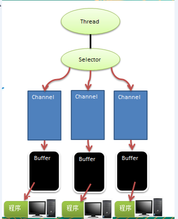

# Java NIO
- Java NIO 全称 java non-blocking IO,是指 JDK 提供的新API。Java提供了一系列改进的输入/输出的新特性，被统称为NIO,是同步非阻塞的
- NIO 的三大核心 Channel Buffer Selector
- NIO是面向缓冲区，面向块 编程的。数据读取到一个它稍后处理的缓冲区，需要时可在缓冲区中前后移动，这就增加了处理过程中的灵活性，需要时可在缓冲区中前后移动，这就增加了处理过程中的灵活性，使用它可以提供非阻塞式的高伸缩性网络
- Java NIO的非阻塞模式，使一个线程从某通道发送请求或者读取数据，但是它仅能得到目前可用的数据，如果目前没有数据可用时，就什么都不会获取，而不是保持线程阻塞，所以直至数据变的可以读取之前，该线程可以继续做其他的事情。 非阻塞写也是如此，一个线程请求写入一些数据到某通道，但不需要等待它完全写入，这个线程同时可以去做别的事情
> NIO是事件驱动的
- NIO是可以做到用一个线程来处理多个操作的。假设有10000个请求过来,根据实际情况，可以分配50或者100个线程来处理。不像之前的阻塞IO那样，非得分配10000个
- HTTP2.0使用了多路复用的技术，做到同一个连接并发处理多个请求，而且并发请求的数量比HTTP1.1大了好几个数量级

## NIO和BIO的比较
- BIO 以流的方式处理数据,而 NIO 以块的方式处理数据,块 I/O 的效率比流 I/O 高很多
- BIO 是阻塞的，NIO 则是非阻塞的
- BIO基于字节流和字符流进行操作，而 NIO 基于 Channel(通道)和 Buffer(缓冲区)进行操作，数据总是从通道读取到缓冲区中，或者从缓冲区写入到通道中。Selector(选择器)用于监听多个通道的事件（比如：连接请求，数据到达等），因此使用单个线程就可以监听多个客户端通道 

## NIO Buffer Channel Selector 关系


- 每个channel 都会对应一个Buffer
- Selector 对应一个线程， 一个线程对应多个channel(连接)
- 该图反应了有三个channel 注册到 该selector (程序)
- 程序切换到哪个channel 是由事件决定的, Event 就是一个重要的概念
- Selector 会根据不同的事件，在各个通道(Channel)上切换
- Buffer 就是一个内存块 ， 底层是有一个数组
- 数据的读取写入是通过Buffer, 这个和BIO , BIO 中要么是输入流，或者是输出流, 不能双向，但是NIO的Buffer 是可以读也可以写, 需要 flip 方法切换
- channel 是双向的, 可以返回底层操作系统的情况, 比如Linux ， 底层的操作系统通道就是双向的

## 缓冲区 (Buffer)
> 缓冲区（Buffer）：缓冲区本质上是一个可以读写数据的内存块，可以理解成是一个容器对象(含数组)，该对象提供了一组方法，可以更轻松地使用内存块，，缓冲区对象内置了一些机制，能够跟踪和记录缓冲区的状态变化情况。Channel 提供从文件、网络读取数据的渠道，但是读取或写入的数据都必须经由 Buffer
- Buffer类定义里所有的缓冲区都具有**4**个属性来提供关于其包含的数据元素的信息
    - Capacity 
    > 容量：即可以容纳的最大数据量；在缓冲区创建时被设定并且不能改变
    - Limit 
    > 表示缓冲区当前终点，不能对缓冲区超过极限的位置进行读写操作。且极限是可以修改的
    - Position
    > 位置，下一个被读或者被写的元素的索引，每次读写缓冲区数据时都会改变改值，为下次读写作准备
    - Mark
    > 标记
- ByteBuffer (网络传输主要都是用字节传输的) 常用API
```
// 缓存创建相关api
// 创建直接缓冲区
public static ByteBuffer allocateDirect(int capacity);

// 设置缓冲区的初始化容量
public static ByteBuffer allocate(int capacity);

// 把一个数组放到缓冲区中使用
public static ByteBuffer wrap(bytep[] array);

// 构造初始化offset和上界length的缓冲区
public static ByteBuffer wrap(byte[] array,int offset,int length)

// 缓存读取相关api
// 从当前为止position上get,position会自动+1
public abstract byte get(); 

// 从绝对位置get
public abstract byte get(int index);

// 从当前位置上普通,put之后，position会自动+ 1
public abstract ByteBuffer put(byte b);

// 从绝对位置上put
public abstract ByteBuffer put(int index,byte b);
```
## 通道 (Channel)
NIO的Channel类似于流，但也有一定的区别
- 通道可以同时进行读写
- 而流只能读或者只能写
- 通道可以从缓冲(Buffer)中读数据，也可以写数据到缓冲(Buffer)

基本介绍
- BIO 中的 stream 是单向的，例如 FileInputStream 对象只能进行读取数据的操作，而 NIO 中的通道(Channel)是双向的，可以读操作，也可以写操作
- Channel在NIO中是一个接口 public interface Channel extends Closeable{} 
- 常用的 Channel 类有：`FileChannel`、`DatagramChannel`、`ServerSocketChannel` 和 `SocketChannel`。`ServerSocketChannel` 类似 `ServerSocket` , `SocketChannel` 类似 `Socket`
- `FileChannel` 用于文件的数据读写，`DatagramChannel` 用于 UDP 的数据读写，`ServerSocketChannel` 和 `SocketChannel` 用于 TCP 的数据读写。

### FileChannel类
`FileChannel主要用来对本地文件进行` IO 操作，常见的方法有
- `public int read(ByteBuffer dst)` ，从通道读取数据并放到缓冲区中
- `public int write(ByteBuffer src)` ，把缓冲区的数据写到通道中
- `public long transferFrom(ReadableByteChannel src, long position, long count)`，从目标通道中复制数据到当前通道
- `public long transferTo(long position, long count, WritableByteChannel target)`，把数据从当前通道复制给目标通道
### 关于FileChannel和Buffer的注意事项
- `ByteBuffer` 支持类型化的put 和 get, put 放入的是什么数据类型，get就应该使用相应的数据类型来取出，否则可能有 `BufferUnderflowException` 异常
- 可以将一个`普通Buffer` 转成 `只读Buffer `
- NIO 还提供了 `MappedByteBuffer`， 可以让文件直接在内存（堆外的内存）中进行修改， 而如何同步到文件由NIO 来完成
- 前面我们讲的读写操作，都是通过一个Buffer 完成的，NIO 还支持 通过`多个Buffer` (即 Buffer 数组) 完成读写操作，即 `Scattering` 和 `Gathering` 