[TOC]


# 一、问题引入

------

为什么 Redis 可以保证高性能？

Redis 读的速度是 110000 次 /s, 写的速度是 81000 次 /s 。

# 二、Redis 底层数据结构

------

## 2.1 SDS

Redis 没有直接使用 C 语言传统的字符串表示，而是自己构建了一套称为简单动态字符串（simple dynamic string）的抽象类型，并将 SDS 作为 Redis 的默认字符串表示

### 2.1.1 SDS 的定义

```c
/*
 * 保存字符串对象的结构
 */
struct sdshdr {
    
    // buf 中已占用空间的长度
    int len;

    // buf 中剩余可用空间的长度
    int free;

    // 数据空间
    char buf[];
};
```

### 2.1.2 创建 SDS 的原因

1. 常数时间获取字符串的长度

   + 普通 C 字符串：strlen(str)

   + SDS 字符串：直接取 len 的值，O(1)的时间复杂度

2. 杜绝缓冲区溢出

   + 普通 C 字符串：执行 strcat(char *dst, char *src) 拼接函数不会检查 dst 空间是否足够，会导致溢出。
   + SDS 字符串：（1）首先检查空间是否足够，（2）不够的话 API 会自动扩展空间，（3）然后执行修改操作。

3. 减少修改字符串时带来的内存重新分配次数

   + 普通 C 字符串：频繁的对字符串进行增长或者缩短时，会触发内存重新分配，设计到复杂的算法以及系统调用，所以通常是比较耗时的操作。

   + SDS 字符串：实现了空间的预分配和惰性释放两种优化策略。

     （1）空间预分配：当对 SDS 进行修改时，不仅分配所必需的空间，还会为 SDS 分配额外的未使用空间。

     （2）惰性释放：当 SDS 需要缩短保存的字符串时，程序并不立即使用内存重分配回收多出来的字节，而是使用 free 属性将这些字节的数量记录下来，并等待将来使用。

## 2.2 链表

```c
/*
 * 双端链表节点
 */
typedef struct listNode {

    // 前置节点
    struct listNode *prev;

    // 后置节点
    struct listNode *next;

    // 节点的值
    void *value;

} listNode;

/*
 * 双端链表结构
 */
typedef struct list {

    // 表头节点
    listNode *head;

    // 表尾节点
    listNode *tail;

    // 节点值复制函数
    void *(*dup)(void *ptr);

    // 节点值释放函数
    void (*free)(void *ptr);

    // 节点值对比函数
    int (*match)(void *ptr, void *key);

    // 链表所包含的节点数量
    unsigned long len;
} list;
```


## 2.3 字典

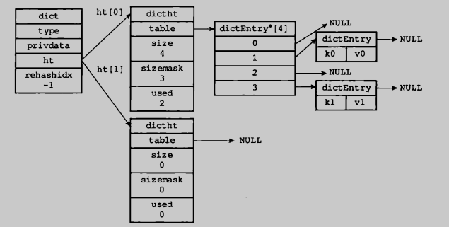

Redis 的字典使用哈希表作为底层实现，一个哈希表里面可以有多个哈希表节点，而每个哈希表节点就保存了字典中的一个键值对。

### 2.3.1 哈希表节点

```c
/*
 * 哈希表节点
 */
typedef struct dictEntry {
    // 键
    void *key;

    // 值，可以是一个指针或者一个整数
    union {
        void *val;
        uint64_t u64;
        int64_t s64;
    } v;

    // 指向下个哈希表节点，形成链表，以此来解决键冲突的问题
    struct dictEntry *next;
} dictEntry;
```


### 2.3.2 哈希表

```c
/*
 * 哈希表
 * 每个字典都使用两个哈希表，从而实现渐进式 rehash 。
 */
typedef struct dictht {
    // 哈希表数组，数组中的每个元素都是一个指向 dictEntry 结构的指针
    dictEntry **table;

    // 哈希表大小
    unsigned long size;
    
    // 哈希表大小掩码，用于计算索引值
    // 总是等于 size - 1
    unsigned long sizemask;

    // 该哈希表已有节点的数量
    unsigned long used;
} dictht;
```


### 2.3.3 字典

```c
/*
 * 字典
 */
typedef struct dict {
    // 类型特定函数
    dictType *type;

    // 私有数据
    void *privdata;

    // 哈希表
    dictht ht[2];

    // rehash 索引
    // 当 rehash 不在进行时，值为 -1
    int rehashidx; /* rehashing not in progress if rehashidx == -1 */

    // 目前正在运行的安全迭代器的数量
    int iterators; /* number of iterators currently running */
} dict;
```


## 2.4 跳跃表

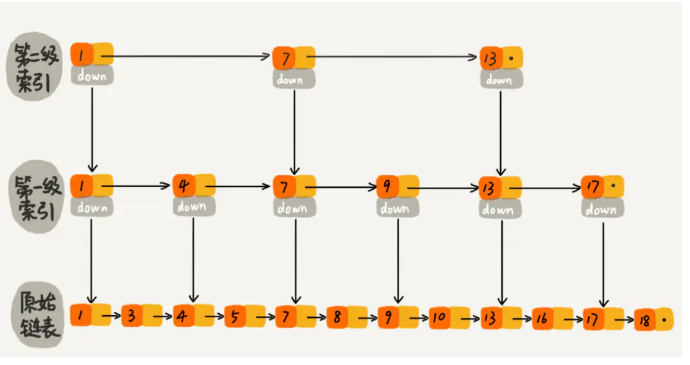

+ 跳跃表的实现由 `zskiplistNode` 和  `zskiplist` 两个结构组成，其中  `zskiplistNode` 用于表示跳跃表中的节点信息，`zskiplistNode` 用于表示跳跃表信息（比如表头节点，表尾节点、长度）。
+ 每个跳跃表节点的层高都是 1 到 32 之间的随机数。
+ 在同一个跳跃表中，多个节点可以包含相同的分值，但每个节点的成员对象必须是唯一的。
+ 跳跃表中的节点按照分值大小进行排序，当分值相同时，节点按照成员对象的大小进行排序。

```c
/*
 * 跳跃表节点
 */
typedef struct zskiplistNode {
    // 成员对象
    robj *obj;

    // 分值
    double score;

    // 后退指针
    struct zskiplistNode *backward;

    // 层
    struct zskiplistLevel {
        // 前进指针
        struct zskiplistNode *forward;

        // 跨度
        unsigned int span;
    } level[];

} zskiplistNode;

/*
 * 跳跃表
 */
typedef struct zskiplist {
    // 表头节点和表尾节点
    struct zskiplistNode *header, *tail;

    // 表中节点的数量
    unsigned long length;

    // 表中层数最大的节点的层数
    int level;
} zskiplist;
```


## 2.5 整数集合

整数集合（intset）是 Redis 用于保存整数值的集合而创建的抽象数据结构，可以用于保存类型为 int16_t、int32_t、int64_t 的整数值，并且保证集合中不会出现重复元素。

```c
#define INTSET_ENC_INT16 (sizeof(int16_t))
#define INTSET_ENC_INT32 (sizeof(int32_t))
#define INTSET_ENC_INT64 (sizeof(int64_t))

typedef struct intset {
    // 编码方式
    uint32_t encoding;

    // 集合包含的元素数量
    uint32_t length;

    // 保存元素的数组
    int8_t contents[];
} intset;
```

> 虽然 intset 结构将 contents 属性声明为 int8_t 类型的数组，但实际上 contents 数组中并不会保存任何 int8_t 类型的值，contents 数组的真正类型取决于 encoding 属性的值

**触发升级**

每当我们将一个新元素添加到整数集合，并且新元素的类型比整数集合现有的所有元素都要长时，整数集合就要先进行升级操作，步骤如下：

1. 根据新元素的类型，扩展整数集合底层数组的空间大小，并未新元素分配空间。
2. 将底层数组现有的元素都转换成与新元素相同的类型，并将类型转换后的元素放置到正确的位置上，防止的过程中需要保持数组有序性不变。
3. 将新元素添加

新建一个 intset，类型为 INTSET_ENC_INT16，插入元素（1，2，3），如下图所示：

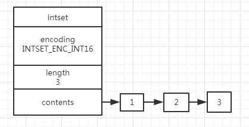

此时数组的分布如下：

| 位   | 0位至15位 | 16位至31位 | 32位至47位 |
| ---- | --------- | ---------- | ---------- |
| 元素 | 1         | 2          | 3          |

此时插入一个元素65535，超出了 16 位所能表示的范围，会引发升级操作，此时的数组分布如下：

| 位   | 0位至31位 | 32位至63位 | 64位至95位 | 96位至127位 |
| ---- | --------- | ---------- | ---------- | ----------- |
| 元素 | 1         | 2          | 3          | 65535       |

此时整型数组的结构如下所示：

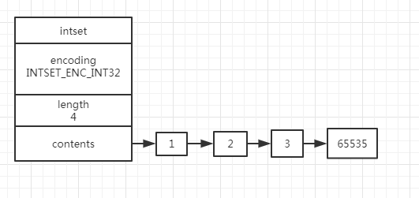

## 2.6 压缩列表

压缩列表是为了节约内存而开发的，是由一些特殊编码的连续内存块组成的顺序型数据结构。一个压缩列表可以包含多个节点（entry），每个节点可以保存一个字节数组或者一个整数值。

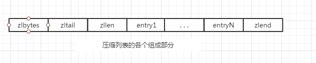

| 属性    | 长            度 | 用途                                                         |
| ------- | ---------------- | ------------------------------------------------------------ |
| zlbytes | 4                | 记录整个压缩表占用的字节数                                   |
| zltail  | 4                | 记录表尾节点距离压缩表起始地址有多少字节，通过这个偏移量，无须遍历整个压缩表就可以确定表尾节点的地址 |
| zllen   | 2                | 记录了压缩表包含的节点数量                                   |
| entryX  | 变长             | 压缩表的各个节点                                             |
| zlend   | 1                | 特殊值 0xFF，用于标记压缩列表的末端                          |

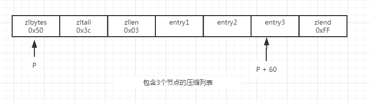

- [x] zlbytes 属性的值为 0x50（十进制80），表示压缩表的总长度是80个字节。
- [x] zltail 属性的值为 0x3c（十进制60），表示如果我们有一个指向压缩表起始地址的指针P，那么只要用指针 P 加上偏移量60，就可以计算出尾节点 entry3 的地址。
- [x] zllen 属性的值为 0x03，表示压缩表包含三个节点。

# 三、Redis 对象概述

------

前面的章节介绍了 5 种数据结构，但是 Redis 并没有直接使用这些数据结构来实现键值对数据库，而是基于这些基础的数据结构创建了对象系统，这个对象系统包括：

+ 字符串对象（string）
+ 列表对象（list）
+ 哈希对象（hash）
+ 集合对象（set）
+ 有序集合对象（zset）

每一种对象都用到了至少一种上面所介绍的基础数据结构。

使用对象的优势：

+ Redis 命令在执行前，可以根据对象的类型来判断一个对象是否可以执行给定的命令。
+ 可以针对不同的使用场景，为对象设置不同的数据结构，从而优化对象在不同场景下的使用效率。

## 3.1 对象模型

每当我们在 Redis 中新建一个键值对时，我们至少会创建两个对象：

+ 一个对象用作键值对的键（键对象）
+ 一个对象用作键值对的值（值对象）

```shell
# 键对象：包含了字符串 "msg" 的对象
# 值对象：包含了字符串 "hello world" 的对象
redis> SET msg "hello world"
```

```c
#define REDIS_LRU_BITS 24

typedef struct redisObject {
    // 类型
    unsigned type:4;

    // 编码
    unsigned encoding:4;

    // 对象最后一次被访问的时间
    unsigned lru:REDIS_LRU_BITS; 

    // 引用计数
    int refcount;

    // 指向实际值的指针
    void *ptr;
} robj;
```

### 3.1.1 对象的类型

`type` 属性记录的是对象的类型，属性值的取值范围如下：

| 类型常量     | 对象的名称   | TYPE 命令的输出 |
| ------------ | ------------ | --------------- |
| REDIS_STRING | 字符串对象   | string          |
| REDIS_LIST   | 列表对象     | list            |
| REDIS_HASH   | 哈希对象     | hash            |
| REDIS_SET    | 集合对象     | set             |
| REDIS_ZSET   | 有序集合对象 | zset            |

对于 Redis 保存的键值对来说，键总是一个字符串对象，而值则可以是上述 5 种类型对象中的任何一种。

> 当我们称呼一个数据库键为“字符串键”时，指的是：这个键所对应的值为字符串对象。
>
> 当我们称呼一个数据库键为“列表键”时，指的是：这个键所对应的值为列表对象。

### 3.1.2 对象的编码与底层实现

`prt` 属性指向对象的底层实现数据结构，而这些数据结构由属性 `encoding`  决定，属性值取值范围如下：

| 编码常量                  | 底层数据结构                | OBJECT  ENCODING 输出 |
| ------------------------- | --------------------------- | --------------------- |
| REDIS_ENCODING_INT        | long 类型的整数             | int                   |
| REDIS_ENCODING_EMBSTR     | embstr 编码的简单动态字符串 | embstr                |
| REDIS_ENCODING_RAW        | 简单动态字符串              | raw                   |
| REDIS_ENCODING_HT         | 字典                        | hashtable             |
| REDIS_ENCODING_LINKEDLIST | 双向链表                    | linkedlist            |
| REDIS_ENCODING_ZIPLIST    | 压缩列表                    | ziplist               |
| REDIS_ENCODING_INTSET     | 整数集合                    | intset                |
| REDIS_ENCODING_SKIPLIST   | 跳跃表和字典                | skiplist              |

每种类型的对象都至少使用了两种不同的编码方式，如下表所示：

| 类型         | 编码                      | 对象                                    |
| ------------ | ------------------------- | --------------------------------------- |
| REDIS_STRING | REDIS_ENCODING_INT        | 使用整数值实现的字符串对象              |
| REDIS_STRING | REDIS_ENCODING_EMBSTR     | 使用 embstr 编码的 SDS 实现的字符串对象 |
| REDIS_STRING | REDIS_ENCODING_RAW        | 使用 SDS 实现的字符串对象               |
| REDIS_LIST   | REDIS_ENCODING_LINKEDLIST | 使用双向链表实现的列表对象              |
| REDIS_LIST   | REDIS_ENCODING_ZIPLIST    | 使用压缩列表实现的列表对象              |
| REDIS_HASH   | REDIS_ENCODING_HT         | 使用字典实现的哈希对象                  |
| REDIS_HASH   | REDIS_ENCODING_ZIPLIST    | 使用压缩列表实现的哈希对象              |
| REDIS_SET    | REDIS_ENCODING_INTSET     | 使用整数集合实现的集合对象              |
| REDIS_SET    | REDIS_ENCODING_HT         | 使用字典实现的集合对象                  |
| REDIS_ZSET   | REDIS_ENCODING_ZIPLIST    | 使用压缩列表实现的有序集合对象          |
| REDIS_ZSET   | REDIS_ENCODING_SKIPLIST   | 使用跳跃表和字典实现的有序结合对象      |

## 3.2 字符串对象

字符串对象有三种底层实现方式：

+ REDIS_ENCODING_INT：适用于字符串对象保存的整数值可以用 long 类型来表示。
+ REDIS_ENCODING_EMBSTR：当字符串对象保存的内容长度小于等于39个字节时。
+ REDIS_ENCODING_RAW：当字符串对象保存的内容长度大于39个字节时。

**embstr 和 raw 的区别：**

+ `embstr` 和 `raw` 都是采用 SDS 的方式保存字符串，区别在于 embstr 是专门用于保存短字符串
+ `raw` 会调用两次内存分配函数为 `redisObject` 结构和 `sdshdr` 结构分配空间。
+ `embstr` 只会调用一次内存分配函数分配一块连续的内存空间，空间中一次包含 `redisObject` 结构和 `sdshdr` 结构。

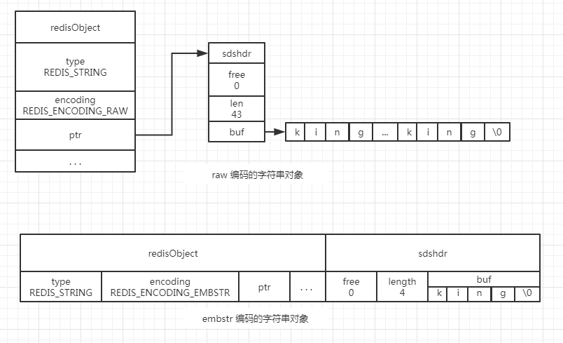

## 3.3 列表对象

列表对象的编码可以是 `ziplist` 和 `linkedlist`。

### 3.3.1 对象结构

假设执行 RPUSH  alph  "aaa" "bbb" "ccc"，则对象结构：

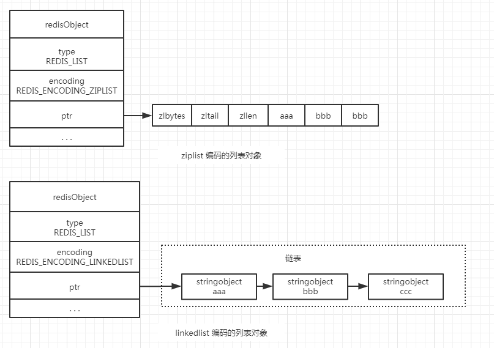

### 3.3.2 使用 ziplist 编码的条件

+ 列表对象保存的所有字符串长度都小于 64 个字节。
+ 列表对象保存的元素数量小于 512 个。

只有当上述两个条件都满足时，才会使用 ziplist 编码。

## 3.4 哈希对象

哈希对象的编码可以是 `ziplist` 或者 `hashtable`。

### 3.4.1 对象结构

假设执行如下命令，则对象结构：

```shell
redis> HSET profile name "tom"
(integer 1)

redis> HSET profile age 25
(integer 1)

redis> HSET profile career "doctor"
(integer 1)
```

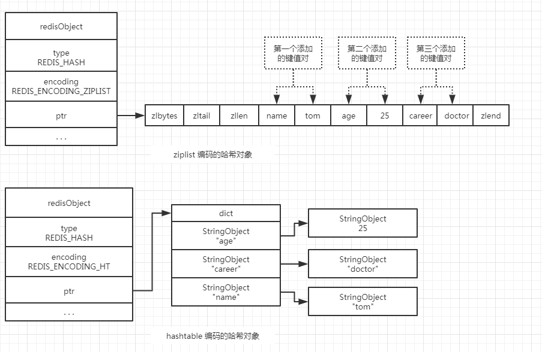

### 3.4.2 对象结构的特点

ziplist 编码的哈希对象特点：

+ 保存了同一键值对的两个节点总是紧挨在一起，保存键的节点在前，保存值的节点在后。
+ 先添加到哈希对象中的键值对会被放置在 ziplist 的表头方向，后添加到哈希对象中的键值对会放置在表尾方向。

hashtable 编码的哈希对象特点：

+ 字典中的每个键都是一个字符串对象，对象中保存了键值对的键。
+ 字典中的每个值都是一个字符串对象，对象中保存了键值对的值。

### 3.4.3 使用 ziplist 编码的条件

- 哈希对象保存的所有键值对的键和值的字符串长度都小于 64 个字节。
- 哈希对象保存的键值对数量小于 512 个。

只有当上述两个条件都满足时，才会使用 ziplist 编码。

## 3.5 集合对象

集合对象的编码可以是 intset 或者 hashtable。

### 3.5.1 对象结构

假设执行如下命令， 则对象结构：

```shell
redis> SADD number 1, 2, 3
(integer 1)

redis> SADD fruits "apple" "banana" "cherry"
(integer 1)
```

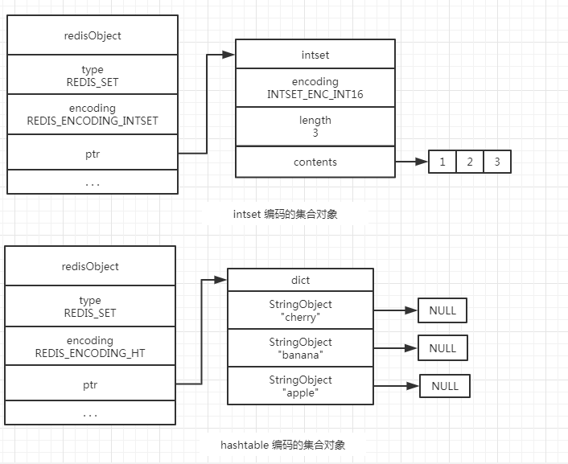

###  3.5.2 使用 intset 编码的条件

+ 集合对象保存的所有元素都是整数值
+ 集合对象保存的元素数量不超过 512 个


## 3.6 有序集合对象

有序集合对象的编码可以是 `ziplist` 和 `skiplist`。

### 3.6.1 对象结构

假设执行如下命令， 则对象结构：

```shell
redis> ZADD price 8.5 "apple"  5.0 "banana" 6.0 "cherry"
(integer 1)
```

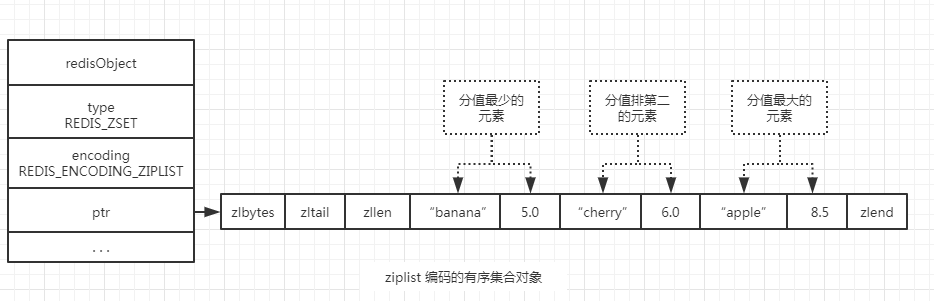

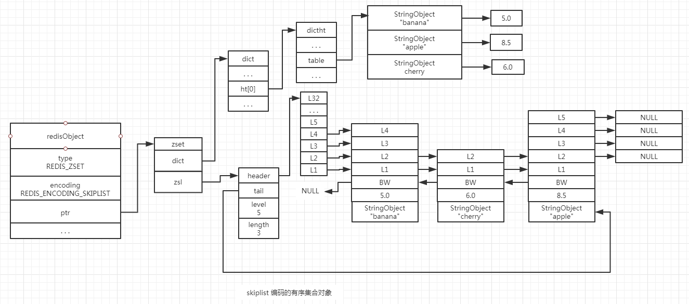

### 3.6.2 对象结构的特点

**ziplist 编码的特点：**

+ 每个集合元素使用两个紧挨在一起的压缩列表节点来保存数据，第一个节点保存元素的成员（member），第二个节点则保存元素的分值（score）。
+ ziplist 内的集合元素按照分值从小到大进行排序，分值较小的元素被放置在靠近表头的位置，分值较大的元素被放置在靠近表尾的位置。

**skiplist 编码的特点：**

`skiplist` 编码的有序集合对象使用了 `zset` 结构作为底层实现

```c
/*
 * 有序集合
 */
typedef struct zset {
    // 字典，键为成员，值为分值
    // 用于支持 O(1) 复杂度的按成员取分值操作
    dict *dict;

    // 跳跃表，按分值排序成员
    // 用于支持平均复杂度为 O(log N) 的按分值定位成员操作以及范围操作
    zskiplist *zsl;
} zset;
```

zset 结构同时使用字典和跳跃表来保存有序集合的元素，但这两种数据结构都会通过指针来共享相同元素的成员和分值，所以同时使用跳跃表和字典来保存集合元素并不会产生任何重复的成员或者分值，不会浪费内存。

### 3.6.3 ziplist 的使用条件

+ 有序集合中保存的元素小于 128 个。
+ 有序集合保存的所有元素成员的长度都小于 64 个字节。

## 3.7 内存回收

```c
typedef struct redisObject {
    //...
    
    // 引用计数
    int refcount;
    
    // ...
} robj;
```

因为C语言不具备自动回收内存的功能，所以 Redis 在自己的对象系统中构建了一个引用计数，实现内存的回收机制，通过这一机制，程序可以通过跟踪对象的引用计数信息，在 `refcount` 为 0 的时候自动释放对象并回收内存。

```c
/*
 * 为对象的引用计数减一
 * 当对象的引用计数降为 0 时，释放对象。
 */
void decrRefCount(redisObject *obj) 
{
    // 引用计数异常时打印日志，然后 exit
    if (obj->refcount <= 0) redisPanic("decrRefCount against refcount <= 0");

    // 释放对象
    if (obj->refcount == 1) 
	{
        switch (obj->type) 
		{
            case REDIS_STRING: freeStringObject(o); break;
            case REDIS_LIST: freeListObject(o); break;
            case REDIS_SET: freeSetObject(o); break;
            case REDIS_ZSET: freeZsetObject(o); break;
            case REDIS_HASH: freeHashObject(o); break;
            default: redisPanic("Unknown object type"); break;
        }
        zfree(obj);
    } 
	else 
	{
        // 减少计数
        obj->refcount--;
    }
}
```

## 3.8 空转时间

```c
typedef struct redisObject {
     //...
    
    // 对象最后一次被访问的时间
    unsigned lru:REDIS_LRU_BITS;
	
     //...
} robj;
```

如果 redis.conf 配置文件中打开了 mexmemory 选项，并且服务器用于回收内存的算法为 volatile-lru 或者 allkey-lru，那么当服务器占用的内存数超过了 mexmemory  选项所设置的上限值，空转时间较高的那部分 key 会被优先释放，从而实现回收内存。

```c
// 遍历所有字典
for (j = 0; j < server.dbnum; j++) 
{
    redisDb *db = server.db + j;
    dict *dict;

    // 如果策略是 allkeys-lru 或者 allkeys-random，那么淘汰的目标为所有数据库键
    if (server.maxmemory_policy == REDIS_MAXMEMORY_ALLKEYS_LRU ||
        server.maxmemory_policy == REDIS_MAXMEMORY_ALLKEYS_RANDOM)
    {
        dict = server.db[j].dict;
    } 
    else 
    {
        // 如果策略是 volatile-lru 、 volatile-random 或者 volatile-ttl 
        // 那么淘汰的目标为带过期时间的数据库键
        dict = server.db[j].expires;
    }
}
```


# 四、数据库

## 4.1 Redis 数据库基本结构

```c
typedef struct redisDb {
    // ...
    
    // 数据库键空间，保存着数据库中的所有键值对
    dict *dict;                

    // 键的过期时间，字典的键为键，字典的值为过期事件 UNIX 时间戳
    dict *expires;            
    
    // ...
} redisDb;
```

## 4.2 Redis 过期键删除策略

Redis 服务器使用的是惰性删除和定期删除另种策略，通过配合使用这两种删除策略，服务器可以很好的在合理使用 CPU 时间和避免浪费内存空间之间取得平衡。

### 4.2.1 惰性删除策略

### 							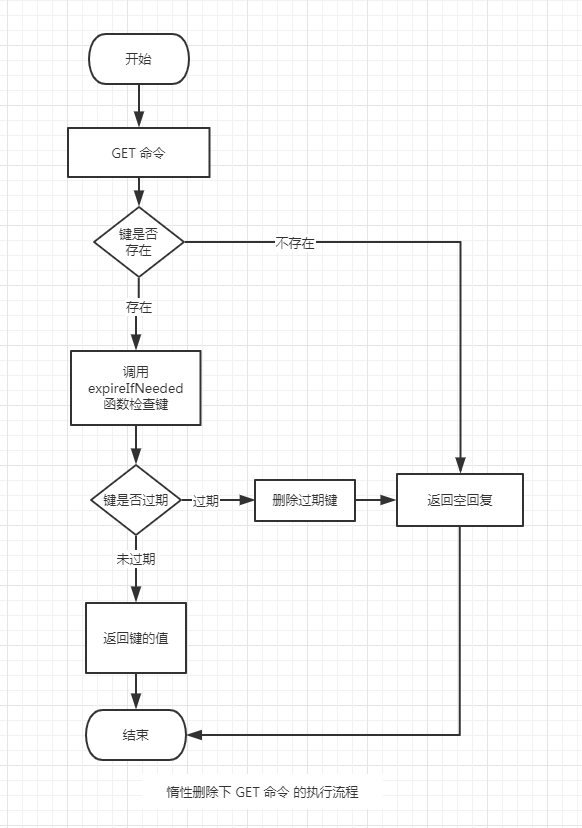

```c
/*
 * 检查 key 是否已经过期，如果是的话，将它从数据库中删除。
 * 返回 0 表示键没有过期时间，或者键未过期。
 * 返回 1 表示键已经因为过期而被删除了。
 */
int expireIfNeeded(redisDb *db, robj *key) 
{
    // 取出键的过期时间
    mstime_t when = getExpire(db, key);
    mstime_t now;

    // 没有过期时间
    if (when < 0) return 0; 

    // 如果服务器正在进行载入，那么不进行任何过期检查
    if (server.loading) return 0;
    now = server.lua_caller ? server.lua_time_start : mstime();
    
    // 当服务器运行在 replication 模式时
    // 附属节点并不主动删除 key
    // 它只返回一个逻辑上正确的返回值
    // 真正的删除操作要等待主节点发来删除命令时才执行
    // 从而保证数据的同步
    if (server.masterhost != NULL) return now > when;

    // 运行到这里，表示键带有过期时间，并且服务器为主节点

    // 如果未过期，返回 0
    if (now <= when) return 0;

    /* Delete the key */
    server.stat_expiredkeys++;

    // 向 AOF 文件和附属节点传播过期信息
    propagateExpire(db, key);

    // 发送事件通知
    notifyKeyspaceEvent(REDIS_NOTIFY_EXPIRED, "expired", key, db->id);

    // 将过期键从数据库中删除
    return dbDelete(db, key);
}

```

``` c
/* Delete a key, value, and associated expiration entry if any, from the DB 
 * 从数据库中删除给定的键，键的值，以及键的过期时间。
 * 删除成功返回 1 ，因为键不存在而导致删除失败时，返回 0 。
 */
int dbDelete(redisDb *db, robj *key) 
{
    // 删除键的过期时间(db->expires)
    if (dictSize(db->expires) > 0) 
    {
        dictDelete(db->expires, key->ptr);
    }

    // 删除键值对(db->dict)
    if (dictDelete(db->dict, key->ptr) == DICT_OK) 
    {
        return 1;
    } 
    else 
    {
        // 键不存在
        return 0;
    }
}
```


### 4.2.2 定期删除策略

Redis 服务器周期性的调用 avtiveExpireCycle 函数，该函数分多次遍历服务器中的各个数据库，从数据库的 expire 字典中随机检查一部分键的过期时间，并删除其中的过期键。

```c
void activeExpireCycle(int type) 
{
    // 默认每次处理的数据库数量
    unsigned int dbs_per_call = REDIS_DBCRON_DBS_PER_CALL;

    // 遍历数据库
    for (j = 0; j < dbs_per_call; j++) 
    {
        // 指向要处理的数据库
        redisDb *db = server.db + (current_db % server.dbnum);
        
        // 为 DB 计数器加一，如果进入 do 循环之后因为超时而跳出
        // 那么下次会直接从下个 DB 开始处理
        current_db++;
        do {
            unsigned long num;
            long long now, ttl_sum;
            int ttl_samples;
            
            // 获取数据库中带过期时间的键的数量
            // 如果该数量为 0 ，直接跳过这个数据库
            if ((num = dictSize(db->expires)) == 0) 
            {
                db->avg_ttl = 0;
                break;
            }
            
            // 开始遍历数据库
            while (num--) 
            {
                dictEntry *de;
                long long ttl;

                // 从 expires 中随机取出一个带过期时间的键
                if ((de = dictGetRandomKey(db->expires)) == NULL) break;
                
                // 如果键已经过期，那么删除它，并将 expired 计数器增一
                if (activeExpireCycleTryExpire(db,de,now)) expired++;
            }
        } while (expired > ACTIVE_EXPIRE_CYCLE_LOOKUPS_PER_LOOP/4);
    }
}
```

# 五、Redis 持久化

------

## 5.1 为什么要做数据持久化

Redis 是将键值对数据保存在内存中，当意外断电或者服务器崩溃的时候，数据将全部丢失，所以在服务运行的过程中需要不断的对数据做持久化操作，保证服务重启的时候可以还原重启之前的数据镜像。

## 5.2 RDB  持久化

### 5.2.1 RDB  文件概述

RDB 持久化就是将 Redis 在内存中某个时间点上的数据库状态保存到一个 RDB 文件中，RDB 持久化既可以手动执行，也可以根据服务器的配置选项定期执行。

### 5.2.2 RDB 文件的创建与载入

**RDB 文件的创建：**

Redis 提供了两个命令用于生成 RDB 文件，一个是 `SAVE`，另一个是 `BGSAVE`。

1. SAVE 命令会阻塞 Redis 服务器，知道 RDB 文件创建完毕，在服务器进程阻塞期间，服务器不能处理任何命令请求
2. BGSAVE 命令不会阻塞 Redis服务器，做法是通过派生出一个子进程，然后由子进程负责创建 RDB 文件，服务器进程（父进程）继续处理客户端的命令请求。

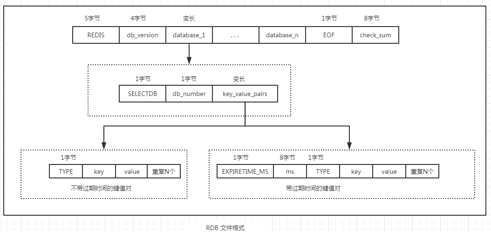

```c
/*
 * 将数据库保存到磁盘上。
 * 保存成功返回 REDIS_OK ，出错/失败返回 REDIS_ERR 。
 */
int rdbSave(char *filename) 
{
    dictIterator *di = NULL;
    dictEntry *de;
    char tmpfile[256];
    char magic[10];
    int j;
    long long now = mstime();
    FILE *fp;
    rio rdb;
    uint64_t cksum;

    // 创建临时文件
    snprintf(tmpfile, 256, "temp-%d.rdb", (int) getpid());
    fp = fopen(tmpfile, "w");
    if (!fp) 
    {
        redisLog(REDIS_WARNING, "Failed opening .rdb for saving: %s", strerror(errno));
        return REDIS_ERR;
    }

    // 初始化 I/O
    rioInitWithFile(&rdb, fp);
        
    // 写入 "REDIS" + db_version
    snprintf(magic,sizeof(magic),"REDIS%04d",REDIS_RDB_VERSION);
    if (rdbWriteRaw(&rdb, magic, 9) == -1) goto werr;

    // 遍历所有数据库
    for (j = 0; j < server.dbnum; j++) 
    {
        // 指向数据库
        redisDb *db = server.db + j;

        // 指向数据库键空间
        dict *d = db->dict;

        // 跳过空数据库
        if (dictSize(d) == 0) continue;

        // 创建键空间迭代器
        di = dictGetSafeIterator(d);
        if (!di) 
        {
            fclose(fp);
            return REDIS_ERR;
        }
        // 写入 "SELECT" + "db_number" 字段
        if (rdbSaveType(&rdb, REDIS_RDB_OPCODE_SELECTDB) == -1) goto werr;
        if (rdbSaveLen(&rdb, j) == -1) goto werr;

        // 遍历键值对，并写入每个键值对的数据
        while((de = dictNext(di)) != NULL) 
        {
            sds keystr = dictGetKey(de);
            robj key, *o = dictGetVal(de);
            long long expire;
            
            // 根据 keystr ，在栈中创建一个 key 对象
            initStaticStringObject(key,keystr);

            // 获取键的过期时间
            expire = getExpire(db, &key);

            // 保存键值对数据
            // 如果有过期时间：写入 “EXPIRE_TIME” + 8个字节的过期时间 + “TYPE” + 键值对
            // 如果没有过期时间：写入 “TYPE” + 键值对
            if (rdbSaveKeyValuePair(&rdb, &key, o, expire, now) == -1) goto werr;
        }
        dictReleaseIterator(di);
    }
    di = NULL; /* So that we don't release it again on error. */

    // 写入 EOF 字段
    rdbSaveType(&rdb, REDIS_RDB_OPCODE_EOF);

    // 写入 checksum 字段
    cksum = rdb.cksum;
    memrev64ifbe(&cksum);
    rioWrite(&rdb, &cksum,8);
    
    // 将临时文件名称改为正式文件名称
    // ....
    
    return REDIS_OK;
}
```

SAVE 和 BGSAVE 都是调用函数 `rdbSave` 完成RDB文件创建的，区别在于 SAVE 使用的是 Redis 父进程直接阻塞调用该函数；而 BGSAVE 则是通过创建子进程来调用该函数，子进程在执行完该函数后会给父进程发送完成的信号，然后父进程完成一些状态变更的收尾工作。

**RDB文件的载入：**

通过函数 rdbLoad(char *filename) 来完成数据的载入工作，该函数的执行与上述  `rdbSave` 是逆向的执行过程，按照之前设计的协议格式解析各个字段，不再赘述。

> 在 BGSAVE 命令执行期间，客户端发送的 SAVE 命令会被服务器拒绝，防止父进程和子进程同时执行两个 `rdbSave` 产生不可控的竞争条件。

### 5.2.3 自动间隔性保存

Redis 允许用户通过设置服务器配置的 `save` 选项，让服务器每隔一段时间自动执行一个 BGSAVE 命令。

```text
save 900 1
save 300 10
save 60 10000
```

满足上述三个条件中的任何一个，将会触发 BGSAVE 的执行：

+ 服务器在 900 秒之内，对数据库进行了至少 1 次修改
+ 服务器在 300 秒之内，对数据库进行了至少 10  次修改
+ 服务器在 60秒之内，对数据库进行了至少 10000 次修改


## 5.3 AOF 持久化

AOF 持久化是通过保存 Redis 服务器所执行的写命令来记录数据库状态的。

```shell
redis> SET msg "hello"
OK

redis> SADD fruit "appple" "banana" "cherry"
(integer) 3

redis> RPUSH number 111 222 333
(integer) 3
```

假设对空白的数据库执行上述三个命令的操作，那么数据库中将包含三个键值对：

+ RDB 持久化是将这三个键值对保存到 RDB文件中
+ AOF 持久化是将服务器执行的 SET、SADD、RPUSH 这按个完成的命令保存到 AOF 文件中。

服务器启动时，可以通过加载和执行 AOF 文件中保存的命令来还原服务器关闭之前的数据库状态。

### 5.3.1  命令追加

当 AOF 持久化功能打开时，服务器在执行完一个写命令之后，就将被执行的命令追加到服务器状态的 aof_buf 缓冲区的末尾：

```c
struct redisServer {
	// ...
    
    // AOF 缓冲区
    sds aof_buf;
    
    // ...
};
```

### 5.3.2  命令的写入与同步

Redis 服务器在每次执行客户端发送的读写命令之前，会调用 flushAppendOnlyFile 函数，考虑是否需要将 aof_buf 缓冲区中的内容写入和保存到 AOF 文件中。而 flushAppendOnlyFile  的行为由服务器配置的 appendfsync 选项的值来决定：

| 选项的值 | 函数的行为                                                   |
| -------- | ------------------------------------------------------------ |
| always   | 将 aof_buf 缓冲区的内容写入并同步到 AOF 文件中               |
| everysec | 将 aof_buf 缓冲区的内容写入到 AOF 文件，如果上次同步 AOF 文件的时间距离现在超过1秒钟，那么再次对 AOF 文件进行同步，并且这个操作是由一个线程单独负责执行 |
| no       | 将 aof_buf 缓冲区中的内容写入到 AOF 文件中，但并不对 AOF 文件中的内容进行同步，何时同步由操作系统自行决定。 |

> 文件的写入与同步的区别：
>
> 文件的写入：只是执行系统调用 write 函数将指定长度的字节写入到对应 fd 的内核缓冲区中而已，并不代表此时内核将这些字节真正写入到磁盘文件中，如果此时断电会导致内核缓存中的数据丢失。为了提高磁盘的写入效率，操作系统的缓存一般设置了水位，当达到水位或者超过一定的时间才会主动的将内核缓存中的内容真正刷新到磁盘上。
>
> 文件的同步：通过系统调用 fsync 强制要求内核将缓存中的内容刷新到磁盘上。在执行 fsync 操作的时候 write 函数会发生阻塞，所以频繁的执行 fsync 会对 redis 的写入操作带来性能影响。
>
> Redis 服务器默认的写入策略是 everysec，兼顾数据的完备性和性能。

### 5.3.3 AOF 文件的载入与数据还原

因为 AOF 文件中包含了重建数据库状态所需要的全部写命令，所以服务器只需要读入并执行一遍 AOF 文件中的所有命令，就可以还原服务器关闭之前的数据库状态。

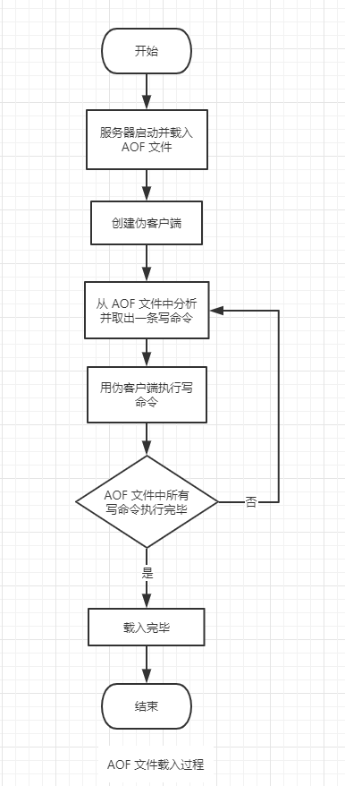

### 5.3.4  AOF  重写

**为什么需要 AOF 重写：**

```shell
redis> RPUSH list "A" "B"	// {"A", "B"}
(integer) 2

redis> RPUSH list "C"		// {"A", "B", "C"}
(integer) 3

redis> RPUSH list "D" "E"   // {"A", "B", "C", "D", "E"}
(integer) 5

redis> LPOP list		   // {"B", "C", "D", "E"}
"A"

redis> LPOP list		   // {"C", "D", "E"}
"B"

redis> RPUSH list "F" "G"   // {"C", "D", "E", "F", "G"}
(integer) 5
```

按照之前介绍的 AOF 文件写入模型，为了记录 list 的数据，需要往 AOF 文件中记录 6 条写命令，对于实际的应用程序来说，写命令的执行次数和频率会比上面的测试程序高的多，所以会造成 AOF 文件体积越来越大，会对 Redis 服务器的运行造成影响，并且在服务重启时加载 AOF 文件还原数据时造成卡顿。为了解决 AOF 文件体积膨胀的问题，Redis 提供了 AOF 文件重写（rewrite）功能。重写后的 AOF 文件保存的数据库状态与原有的 AOF 文件相同，但是新的 AOF 文件不会包含任何浪费空间的冗余命令，体积也小的多。


**AOF 重写的原理：**

如果服务器想用尽量少的命令来记录 list 键的状态，最简单高效的办法就是直接从数据库中读取 list 键的值，然后用一条命令：`RPUSH list "A"  "B"  "C" "D" "E" "F" "G"`  命令来代替保存在 AOF 文件中的 6 条命令。

### 5.3.5 AOF 后台重写

AOF 重写会进行大量的写入操作，如果是在在父进程中执行这个操作将会导致进程被阻塞住，这时客户端传奇过来的所有命令将无法处理，所以 Redis 决定将这个操作放到子进程里去执行，这样做的好处：

+ 子进程在进行 AOF 重写的时候，服务器父进程可以继续处理客户端的命令。
+ 子进程带有服务器父进程的数据副本，使用子进程而不是线程，可以在避免使用锁的情况下，保证数据的安全性。

**存在的问题：**

子进程在进行 AOF 重写期间，服务器父进程还在继续处理客户端的命令请求，而新的命令可能会对现有的数据库状态进行修改，从而导致服务器当前的数据库状态和重写后的 AOF 文件所保存的数据库状态存在不一致（时间差）。

| 时间 | 服务器进程（父进程）          | 子进程            |
| :--: | ----------------------------- | ----------------- |
|  T1  | 执行命令 SET k1 v1            |                   |
|  T2  | 执行命令 SET k1 v2            |                   |
|  T3  | 执行命令 SET k1 v3            |                   |
|  T4  | 创建子进程，执行 AOF 文件重写 | 开始 AOF 文件重写 |
|  T5  | 执行命令 SET k2 10086         | 执行重写操作      |
|  T6  | 执行命令 SET k3 10087         | 执行重写操作      |
|  T7  | 执行命令 SET k4 10088         | 完成 AOF 文件重写 |

执行完 AOF 重写后，新的 AOF 文件中只包含 K1，而服务器数据库中包含的是K1、K2、K3、K4


**解决方案：**

```c
struct redisServer {
	// ...
    
    // AOF 重写缓存链表，链接着多个缓存块
    list *aof_rewrite_buf_blocks;
    
    // ...
};
```

在 Redis 服务器的结构中增加一个 AOF 重写缓冲区，这个缓冲区在服务器创建了子线程之后开始使用 。当 Redis 服务器执行完一个写命令之后，它会同时将这个写命令发送给 AOF 缓冲区（aof_buf）和 AOF 重写缓冲区（aof_rewrite_buf_blocks）。

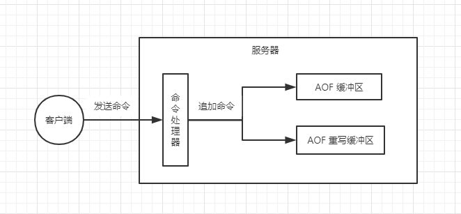

当子进程执行完重写 AOF 文件后，向父进程发送一个信号，父进程捕获到这个信号后，将重写 AOF 缓存中的数据追加到新的 AOF 文件中。

| 时间 | 服务器进程（父进程）                             | 子进程                              |
| :--: | ------------------------------------------------ | ----------------------------------- |
|  T1  | 执行命令 SET k1 v1                               |                                     |
|  T2  | 执行命令 SET k1 v2                               |                                     |
|  T3  | 执行命令 SET k1 v3                               |                                     |
|  T4  | 创建子进程，执行 AOF 文件重写                    | 开始 AOF 文件重写                   |
|  T5  | 执行命令 SET k2 10086                            | 执行重写操作                        |
|  T6  | 执行命令 SET k3 10087                            | 执行重写操作                        |
|  T7  | 执行命令 SET k4 10088                            | 完成 AOF 文件重写，向父进程发送信号 |
|  T8  | 捕获子进程信号，将 k2、k3、k4追加到 AOF 文件末尾 |                                     |
|  T9  | 用新的 AOF 文件覆盖原来的 AOF 文件               |                                     |

# 六、Redis 客户端

------

Redis 服务器是典型的一对多服务器程序：一个服务器可以与多个客户端建立网络连接，每个客户端都可以向服务器发送命令请求，而服务器接收并处理客户端的命令请求，向客户端发送命令回复。

```c
/* 
 * 因为 I/O 复用的缘故，需要为每个客户端维持一个状态。
 * 多个客户端状态被服务器用链表连接起来。
*/
typedef struct redisClient {

    // 套接字描述符，唯一标识一个客户端
    // 伪客户端的fd值为-1
    int fd;

    // 客户端的名字（不区分大小写）
    robj *name;        

    // 参数数量
    int argc;

    // 参数对象数组
    robj **argv;

    // 记录被客户端执行的命令
    struct redisCommand *cmd;

    // 创建客户端的时间
    time_t ctime;          

    // 客户端最后一次和服务器互动的时间
    time_t lastinteraction; /* time of the last interaction, used for timeout */

    // 当 server.requirepass 不为 NULL 时
    // 代表认证的状态
    // 0 代表未认证， 1 代表已认证
    int authenticated;      /* when requirepass is non-NULL */
    
    // 查询缓冲区（输入缓冲区），大小会动态改变，但是最大不能超过1G，否则服务器将关闭这个client
    // 存放客户端的命令请求
    sds querybuf;

    // 回复偏移量，记录了buf数组目前已使用的字节数
    int bufpos;

    // 回复缓冲区（输出缓冲区16K），用于保存长度比较小的回复
    // 如：OK、简短的字符串值、整数值、错误回复等
    // 当空间用完，或者回复太大没法放进buf中时，服务器会开始使用可变大小缓冲区reply链表
    char buf[REDIS_REPLY_CHUNK_BYTES];
    
     // 回复链表（输出缓冲区，可变大小）
    list *reply;

} redisClient;

```

# 七、Redis 服务器

------

Redis 在服务启动的时候会创建一个全局的 redisSever 实例，该实例就代表整个 Redis 服务器的运行状态：

```c
struct redisServer {
    // 配置文件的绝对路径
    char *configfile;          

    // serverCron() 每秒调用的次数
    int hz;                    

    // 数据库
    redisDb *db;

    // 命令表（受到 rename 配置选项的作用）
    dict *commands; 
    
    // 命令表（无 rename 配置选项的作用）
    dict *orig_commands;       

    // 事件状态（支撑起 Redis 事件机制的核心结构）
    aeEventLoop *el;
    
    char *bindaddr[REDIS_BINDADDR_MAX];      // 配置文件中的服务器IP地址
    int bindaddr_count;       			    // 地址数量   
    int ipfd[REDIS_BINDADDR_MAX];  		    // 监听套接字描述符
    int ipfd_count;        				   // 描述符数量      
    list *clients;             			   // 一个链表，保存了所有客户端状态结构 
    list *clients_to_close;     		   // 链表，保存了所有待关闭的客户端
    
    pid_t aof_child_pid;             // 负责进行 AOF 重写的子进程 ID
    int aof_fsync;                   // 所使用的 fsync 策略（每个写入/每秒/从不）
    char *aof_filename;              // AOF 文件名
    int aof_fd;       				// AOF 文件的描述符
    list *aof_rewrite_buf_blocks;  	 // AOF 重写缓存链表，链接着多个缓存块
    sds aof_buf;     				// AOF 缓冲区
     
    pid_t rdb_child_pid;             // 负责执行 BGSAVE 的子进程的 ID , 没在执行 BGSAVE 时，设为 -1
    struct saveparam *saveparams;    // BGSAVE 触发的条件
    char *rdb_filename;              // RDB 文件名称
};
```

# 八、 事件机制

------

## 8.1 事件概述

Redis 是一个事件驱动程序，服务器主要处理以下两种事件：

+ 文件事件（file event）

  Redis 服务器通过套接字与客户端（或者其他 Redis 服务器）进行连接，而文件事件就是服务器对套接字操作的抽象。服务器与客户端的通信会产生相应的文件事件，而服务器则通过监听并处理这些事件来完成一些列网络通信操作。

+ 时间事件（time event）

  Redis 服务器中的一些操作（比如 ServerCron 函数）需要在给定的时间点执行，而时间事件就是对服务器对这类定时操作的抽象。

```c
/*
 * 事件处理器的状态
 */
typedef struct aeEventLoop {

    // 目前已注册的最大描述符
    int maxfd;   

    // 目前已追踪的最大描述符
    int setsize; 

    // 用于生成时间事件 id
    long long timeEventNextId;

    // 最后一次执行时间事件的时间
    time_t lastTime;     

    // 已注册的文件事件
    aeFileEvent *events; 

    // 已就绪的文件事件
    aeFiredEvent *fired;

    // 时间事件
    aeTimeEvent *timeEventHead;

    // 事件处理器的开关
    int stop;

    // 多路复用库的私有数据
    void *apidata; 

    // 在处理事件前要执行的函数
    aeBeforeSleepProc *beforesleep;
} aeEventLoop;
```


```c
int main ()
{
    // ...
    
    aeMain(server.el);

    // 服务器关闭，停止事件循环
    aeDeleteEventLoop(server.el);

    // ...
}
```

```c
/*
 * 事件处理器的主循环
 */
void aeMain(aeEventLoop *eventLoop) 
{
    eventLoop->stop = 0;

    while (!eventLoop->stop) 
	{
        // 如果有需要在事件处理前执行的函数，那么运行它
        if (eventLoop->beforesleep != NULL)
		{ 
			eventLoop->beforesleep(eventLoop);
		}
            
        // 开始处理事件，阻塞在 epoll_wait 操作上，等待的时间为最近一次时间事件即将到达的时间
        // 不然会导致程序彻底阻塞，无法执行时间事件
        aeProcessEvents(eventLoop, AE_ALL_EVENTS);
    }
}
```


## 8.2 文件事件

**概述：**

Redis 基于 Reator 模式开发了自己的网络事件处理器：文件事件处理器（file event handler）。

+ 文件事件处理器以单线程方式运行，使用 I/O 多路复用程序（epoll）来同时监听多个套接字，并根据套接字目前执行的任务来为套接字关联不同的事件处理器。既实现了高性能的网络模型，又可以很好的与 Redis 服务器中其他同样以单线程方式运行的模块进行对接，保持了 Redis 内部单线程设计的简单性。

+ 当被监听的套接字准备好执行应答（accpet）、读取（read）、写入（write）、关闭（close）等操作时，与操作相对应的文件事件就会产生，这时文件事件处理器就会调用套接字之前关联好的事件处理器处理这些事件。

  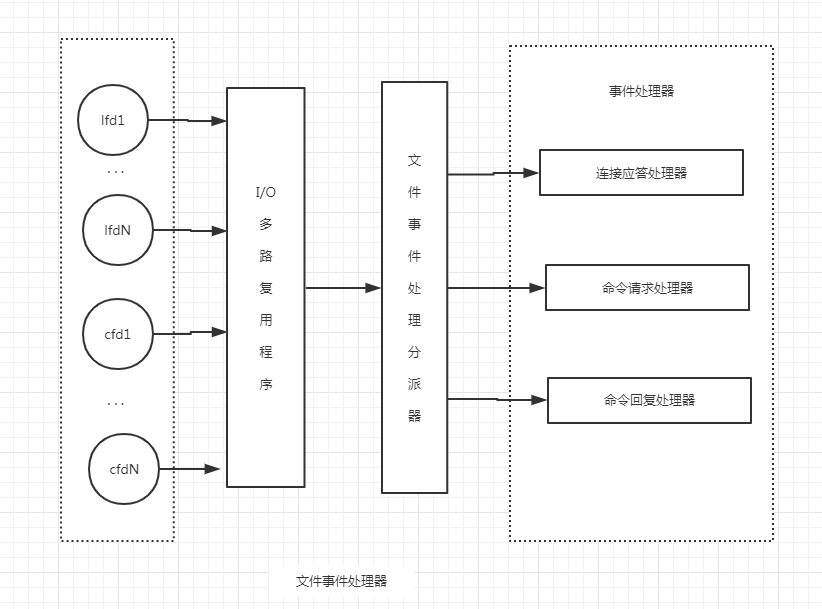

  

**事件类型：**

+ 当套接字变的可读时，套接字产生 AE_READABLE 事件。
  1. 客户端对套接字执行了 write 操作。
  2. 客户端对套接字执行了 close 操作。
  3. 有新的连接上来。
+ 当套接字变的可写时，套接字产生 AE_WTITABLE 事件。
  1. 客户端对套接字执行了 read 操作。

### 8.2.1 连接应答处理器

Redis 服务在启动的时候会读取配置文件中套接字的配置信息（IP 和端口），并创建对应的监听套接字（lfd），然后为这些 lfd 创建 epoll 的节点，添加到 epoll 树上，此时便开启了客户端连接请求的监听功能，等待客户端的连接：

```shell
# Accept connections on the specified port, default is 6379.
# If port 0 is specified Redis will not listen on a TCP socket.
port 6379

# By default Redis listens for connections from all the network interfaces
# available on the server. It is possible to listen to just one or multiple
# interfaces using the "bind" configuration directive, followed by one or
# more IP addresses.
#
# Examples:
#
bind 192.168.1.100 10.0.0.1
# bind 127.0.0.1
```

```c
// 创建服务器的监听套接字
int listenToPort(int port, int *fds, int *count) 
{
    int j;
    if (server.bindaddr_count == 0) 
    {
        server.bindaddr[0] = NULL;
    }

    for (j = 0; j < server.bindaddr_count || j == 0; j++) 
    {
        if (server.bindaddr[j] == NULL) 
        {
            // ...
        } 
		else if (strchr(server.bindaddr[j],':')) 
		{
            /* Bind IPv6 address. */
            fds[*count] = anetTcp6Server(server.neterr,port,server.bindaddr[j], server.tcp_backlog);
        } 
		else 
		{
            /* Bind IPv4 address. */
            fds[*count] = anetTcpServer(server.neterr,port,server.bindaddr[j], server.tcp_backlog);
        }

        anetNonBlock(NULL, fds[*count]);
        (*count)++;
    }

    return REDIS_OK;
}
```

```c
// 为 TCP 连接关联连接应答（accept）处理器
// 用于接受并应答客户端的 connect() 调用
// server.el 结构中带有 epoll 树根节点，方便将所有的监听套接字全部添加到树上
// 监听的事件为套接字可读事件：AE_READABLE
// 当触发了可读事件后，对应的处理器是：acceptTcpHandler
for (j = 0; j < server.ipfd_count; j++) 
{
    if (aeCreateFileEvent(server.el, server.ipfd[j], AE_READABLE, acceptTcpHandler, NULL) == AE_ERR)
    {
        redisPanic("Unrecoverable error creating server.ipfd file event.");
    }
}
```

```c
/* 
 * 创建一个 TCP 连接处理器
 */
void acceptTcpHandler(aeEventLoop *el, int fd, void *privdata, int mask) 
{
    int cport, cfd, max = MAX_ACCEPTS_PER_CALL;
    char cip[REDIS_IP_STR_LEN];
  
    while (max--) 
    {
        // accept 客户端连接
        cfd = anetTcpAccept(server.neterr, fd, cip, sizeof(cip), &cport);
        
        // 为客户端创建客户端状态（redisClient）
        // 创建客户端
        redisClient *client;
        client = createClient(fd)
    }
}
```

```c
/*
 * 创建一个新客户端
 */
redisClient *createClient(int fd) 
{
    // 分配空间
    redisClient *client = zmalloc(sizeof(redisClient));

    // 当 fd 不为 -1 时，创建带网络连接的客户端
    // 如果 fd 为 -1 ，那么创建无网络连接的伪客户端
    // 因为 Redis 的命令必须在客户端的上下文中使用，所以在执行 Lua 环境中的命令时
    // 需要用到这种伪终端
    if (fd != -1) 
    {
        // 非阻塞
        anetNonBlock(NULL, fd);

        // 禁用 Nagle 算法
        anetEnableTcpNoDelay(NULL, fd);

        // 设置 keep alive
        if (server.tcpkeepalive)
        {
            anetKeepAlive(NULL, fd, server.tcpkeepalive);
        }
            
        // 绑定读事件到事件 loop （开始接收命令请求）
        // 将 cfd 也添加到 epoll 树上监听该该套接字的客户端读写命令
        // 监听的时间类型：AE_READABLE
        // 时间处理器：readQueryFromClient
        aeCreateFileEvent(server.el, fd, AE_READABLE, readQueryFromClient, client)
    }
  
    c->fd = fd; 				// 套接字
    c->bufpos = 0; 				// 回复缓冲区的偏移量，已经写入的字节数
    c->querybuf = sdsempty(); 	 // 查询缓冲区
    c->argc = 0;	 			// 命令参数数量
    c->argv = NULL;				// 命令参数
    c->cmd = c->lastcmd = NULL;  // 当前执行的命令和最近一次执行的命令
    c->sentlen = 0; 			// 已发送字节数
    c->flags = 0; 				// 状态 FLAG
    c->ctime = c->lastinteraction = server.unixtime; // 创建时间和最后一次互动时间
    c->authenticated = 0; 		 // 认证状态
    c->reply = listCreate(); 	 // 回复链表
    c->reply_bytes = 0; 		// 回复链表的字节量
    
    // 如果不是伪客户端，那么添加到服务器的客户端链表中
    if (fd != -1) 
    {
        listAddNodeTail(server.clients, client);
    }
    
    return client;
}
```

到此，服务已经创建了 N 个监听套接字，并把这些套接字添加到了 epoll 上，并设置对应的处理函数，让这些套接字负责监听客户端的连接，当客户端有连接请求时，触发 AE_READABLE 事件，执行处理函数 acceptTcpHandler 接受连接，然后为这些连接创建对应的 redisClient 结构，同时把客户端的连接套接字也添加到 epoll  树上，让客户端的套接字负责监听客户端的读写命令请求，并设置对应的处理函数，一旦客户端请求命令到达时，将触发客户端连接套接字的 AE_READABLE 事件，继而触发 处理函数 readQueryFromClient 来处理命令请求。

### 8.2.2 命令请求处理器

readQueryFromClient 是 Redis 的命令请求处理器，这个处理器负责从套接字中读取客户端发送的请求命令内容，具体实现是 unistd.h/read 函数的包装。

```c
/*
 * 读取客户端的查询缓冲区内容
 */
void readQueryFromClient(aeEventLoop *el, int fd, void *privdata, int mask) 
{
    redisClient *client = (redisClient*) privdata;
    
    // ...
  
    // 读入内容到查询缓存
    nread = read(fd, client->querybuf + qblen, readlen);
    
    // ...
   
    // 从查询缓存重读取内容，创建参数，并执行命令
    // 函数会执行到缓存中的所有内容都被处理完为止
    processInputBuffer(client);
}

```


```c
// 处理客户端输入的命令内容
// 1. 根据 Redis 的协议解析出命令参数
// 2. 根据命令参数执行命令
void processInputBuffer(redisClient *client) 
{
    while (sdslen(client->querybuf)) 
	{
     	// ...
        
        // 1. 将缓冲区中的内容转换成命令，以及命令参数
        if (client->reqtype == REDIS_REQ_INLINE) 
		{
            if (processInlineBuffer(client) != REDIS_OK) break;
        } 
		else if (client->reqtype == REDIS_REQ_MULTIBULK) 
		{
            if (processMultibulkBuffer(client) != REDIS_OK) break;
        } 
		else 
		{
            redisPanic("Unknown request type");
        }
        
        // ...

        // 2. 执行命令，并重置客户端
        if (processCommand(client) == REDIS_OK)
        {
            resetClient(client);
        }        
    }
}
```


```c
// 查找并执行函数
int processCommand(redisClient *c) 
{
    // 查找命令，并进行命令合法性检查，以及命令参数个数检查
    // 根据之前介绍的命令字典，根据命令名称索引出 redisCommand 结构
    c->cmd = c->lastcmd = lookupCommand(c->argv[0]->ptr);
    if (!c->cmd) 
    {
        // 没找到指定的命令
        addReplyErrorFormat(c,"unknown command '%s'", (char*)c->argv[0]->ptr);
        return REDIS_OK;
    } 
    else if ((c->cmd->arity > 0 && c->cmd->arity != c->argc) || (c->argc < -c->cmd->arity)) 
    {
        // 参数个数错误
        addReplyErrorFormat(c,"wrong number of arguments for '%s' command", c->cmd->name);
        return REDIS_OK;
    }
    
    // ...

	// 执行实现函数
    c->cmd->proc(c);

  	// ...
	
    return REDIS_OK;
}
```


### 8.2.3 命令回复处理器

**客户端传递的命令如何映射到具体的执行函数：**

1. Redis 的每一个命令都被抽象成如下的数据结构：

```c
/*
 * Redis 命令
 */
struct redisCommand {
    // 命令名字
    char *name;

    // 实现函数
    redisCommandProc *proc;

    // 参数个数
    int arity;

    // 字符串表示的 FLAG
    char *sflags; 

    // 实际 FLAG
    int flags;    
  
    // 从命令中判断命令的键参数。在 Redis 集群转向时使用。
    redisGetKeysProc *getkeys_proc;

    // 指定哪些参数是 key
    int firstkey; /* The first argument that's a key (0 = no keys) */
    int lastkey;  /* The last argument that's a key */
    int keystep;  /* The step between first and last key */

    // 统计信息
    // microseconds 记录了命令执行耗费的总毫微秒数
    // calls 是命令被执行的总次数
    long long microseconds, calls;
};
```

2. 定义一个全局数据，数据的类型是上述定义的 redisCommand 结构，并进行初始化，将目前 Redis 所支持的所有命令以及命令的处理函数做初始化操作

```c
struct redisCommand redisCommandTable[] = {
    {"get",getCommand,2,"r",0,NULL,1,1,1,0,0},
    {"set",setCommand,-3,"wm",0,NULL,1,1,1,0,0},
    {"setnx",setnxCommand,3,"wm",0,NULL,1,1,1,0,0},
    {"setex",setexCommand,4,"wm",0,NULL,1,1,1,0,0},
    {"psetex",psetexCommand,4,"wm",0,NULL,1,1,1,0,0},
    {"append",appendCommand,3,"wm",0,NULL,1,1,1,0,0},
    {"strlen",strlenCommand,2,"r",0,NULL,1,1,1,0,0},
    {"del",delCommand,-2,"w",0,NULL,1,-1,1,0,0},
    {"exists",existsCommand,2,"r",0,NULL,1,1,1,0,0},
    {"setbit",setbitCommand,4,"wm",0,NULL,1,1,1,0,0},
    {"getbit",getbitCommand,3,"r",0,NULL,1,1,1,0,0},
    {"setrange",setrangeCommand,4,"wm",0,NULL,1,1,1,0,0},
    {"getrange",getrangeCommand,4,"r",0,NULL,1,1,1,0,0},
    {"substr",getrangeCommand,4,"r",0,NULL,1,1,1,0,0},
    {"incr",incrCommand,2,"wm",0,NULL,1,1,1,0,0},
    {"decr",decrCommand,2,"wm",0,NULL,1,1,1,0,0},
    {"mget",mgetCommand,-2,"r",0,NULL,1,-1,1,0,0},
    {"rpush",rpushCommand,-3,"wm",0,NULL,1,1,1,0,0},
    {"lpush",lpushCommand,-3,"wm",0,NULL,1,1,1,0,0},
    {"rpushx",rpushxCommand,3,"wm",0,NULL,1,1,1,0,0},
    {"lpushx",lpushxCommand,3,"wm",0,NULL,1,1,1,0,0},
    {"linsert",linsertCommand,5,"wm",0,NULL,1,1,1,0,0},
    {"rpop",rpopCommand,2,"w",0,NULL,1,1,1,0,0},
    {"lpop",lpopCommand,2,"w",0,NULL,1,1,1,0,0},
    {"brpop",brpopCommand,-3,"ws",0,NULL,1,1,1,0,0},
    {"brpoplpush",brpoplpushCommand,4,"wms",0,NULL,1,2,1,0,0},
    {"blpop",blpopCommand,-3,"ws",0,NULL,1,-2,1,0,0},
    {"llen",llenCommand,2,"r",0,NULL,1,1,1,0,0},
    {"lindex",lindexCommand,3,"r",0,NULL,1,1,1,0,0},
    {"lset",lsetCommand,4,"wm",0,NULL,1,1,1,0,0},
    {"lrange",lrangeCommand,4,"r",0,NULL,1,1,1,0,0},
    {"ltrim",ltrimCommand,4,"w",0,NULL,1,1,1,0,0},
    {"lrem",lremCommand,4,"w",0,NULL,1,1,1,0,0},
    {"rpoplpush",rpoplpushCommand,3,"wm",0,NULL,1,2,1,0,0},
    {"sadd",saddCommand,-3,"wm",0,NULL,1,1,1,0,0},
    {"srem",sremCommand,-3,"w",0,NULL,1,1,1,0,0},
    {"smove",smoveCommand,4,"w",0,NULL,1,2,1,0,0},
    {"sismember",sismemberCommand,3,"r",0,NULL,1,1,1,0,0},
    {"scard",scardCommand,2,"r",0,NULL,1,1,1,0,0},
    {"spop",spopCommand,2,"wRs",0,NULL,1,1,1,0,0},
    {"srandmember",srandmemberCommand,-2,"rR",0,NULL,1,1,1,0,0},
    {"sinter",sinterCommand,-2,"rS",0,NULL,1,-1,1,0,0},
    {"sinterstore",sinterstoreCommand,-3,"wm",0,NULL,1,-1,1,0,0},
    {"sunion",sunionCommand,-2,"rS",0,NULL,1,-1,1,0,0},
    {"sunionstore",sunionstoreCommand,-3,"wm",0,NULL,1,-1,1,0,0},
    {"sdiff",sdiffCommand,-2,"rS",0,NULL,1,-1,1,0,0},
    {"sdiffstore",sdiffstoreCommand,-3,"wm",0,NULL,1,-1,1,0,0},
    {"smembers",sinterCommand,2,"rS",0,NULL,1,1,1,0,0},
    {"sscan",sscanCommand,-3,"rR",0,NULL,1,1,1,0,0},
    {"zadd",zaddCommand,-4,"wm",0,NULL,1,1,1,0,0},
    {"zincrby",zincrbyCommand,4,"wm",0,NULL,1,1,1,0,0},
    {"zrem",zremCommand,-3,"w",0,NULL,1,1,1,0,0},
    {"zremrangebyscore",zremrangebyscoreCommand,4,"w",0,NULL,1,1,1,0,0},
    {"zremrangebyrank",zremrangebyrankCommand,4,"w",0,NULL,1,1,1,0,0},
    {"zremrangebylex",zremrangebylexCommand,4,"w",0,NULL,1,1,1,0,0},
    {"zunionstore",zunionstoreCommand,-4,"wm",0,zunionInterGetKeys,0,0,0,0,0},
    {"zinterstore",zinterstoreCommand,-4,"wm",0,zunionInterGetKeys,0,0,0,0,0},
    {"zrange",zrangeCommand,-4,"r",0,NULL,1,1,1,0,0},
    {"zrangebyscore",zrangebyscoreCommand,-4,"r",0,NULL,1,1,1,0,0},
    {"zrevrangebyscore",zrevrangebyscoreCommand,-4,"r",0,NULL,1,1,1,0,0},
    {"zrangebylex",zrangebylexCommand,-4,"r",0,NULL,1,1,1,0,0},
    {"zrevrangebylex",zrevrangebylexCommand,-4,"r",0,NULL,1,1,1,0,0},
    {"zcount",zcountCommand,4,"r",0,NULL,1,1,1,0,0},
    {"zlexcount",zlexcountCommand,4,"r",0,NULL,1,1,1,0,0},
    {"zrevrange",zrevrangeCommand,-4,"r",0,NULL,1,1,1,0,0},
    {"zcard",zcardCommand,2,"r",0,NULL,1,1,1,0,0},
    {"zscore",zscoreCommand,3,"r",0,NULL,1,1,1,0,0},
    {"zrank",zrankCommand,3,"r",0,NULL,1,1,1,0,0},
    {"zrevrank",zrevrankCommand,3,"r",0,NULL,1,1,1,0,0},
    {"zscan",zscanCommand,-3,"rR",0,NULL,1,1,1,0,0},
    {"hset",hsetCommand,4,"wm",0,NULL,1,1,1,0,0},
    {"hsetnx",hsetnxCommand,4,"wm",0,NULL,1,1,1,0,0},
    {"hget",hgetCommand,3,"r",0,NULL,1,1,1,0,0},
    {"hmset",hmsetCommand,-4,"wm",0,NULL,1,1,1,0,0},
    {"hmget",hmgetCommand,-3,"r",0,NULL,1,1,1,0,0},
    {"hincrby",hincrbyCommand,4,"wm",0,NULL,1,1,1,0,0},
    {"hincrbyfloat",hincrbyfloatCommand,4,"wm",0,NULL,1,1,1,0,0},
    {"hdel",hdelCommand,-3,"w",0,NULL,1,1,1,0,0},
    {"hlen",hlenCommand,2,"r",0,NULL,1,1,1,0,0},
    {"hkeys",hkeysCommand,2,"rS",0,NULL,1,1,1,0,0},
    {"hvals",hvalsCommand,2,"rS",0,NULL,1,1,1,0,0},
    {"hgetall",hgetallCommand,2,"r",0,NULL,1,1,1,0,0},
    {"hexists",hexistsCommand,3,"r",0,NULL,1,1,1,0,0},
    {"hscan",hscanCommand,-3,"rR",0,NULL,1,1,1,0,0},
    {"incrby",incrbyCommand,3,"wm",0,NULL,1,1,1,0,0},
    {"decrby",decrbyCommand,3,"wm",0,NULL,1,1,1,0,0},
    {"incrbyfloat",incrbyfloatCommand,3,"wm",0,NULL,1,1,1,0,0},
    {"getset",getsetCommand,3,"wm",0,NULL,1,1,1,0,0},
    {"mset",msetCommand,-3,"wm",0,NULL,1,-1,2,0,0},
    {"msetnx",msetnxCommand,-3,"wm",0,NULL,1,-1,2,0,0},
    {"randomkey",randomkeyCommand,1,"rR",0,NULL,0,0,0,0,0},
    {"select",selectCommand,2,"rl",0,NULL,0,0,0,0,0},
    {"move",moveCommand,3,"w",0,NULL,1,1,1,0,0},
    {"rename",renameCommand,3,"w",0,NULL,1,2,1,0,0},
    {"renamenx",renamenxCommand,3,"w",0,NULL,1,2,1,0,0},
    {"expire",expireCommand,3,"w",0,NULL,1,1,1,0,0},
    {"expireat",expireatCommand,3,"w",0,NULL,1,1,1,0,0},
    {"pexpire",pexpireCommand,3,"w",0,NULL,1,1,1,0,0},
    {"pexpireat",pexpireatCommand,3,"w",0,NULL,1,1,1,0,0},
    {"keys",keysCommand,2,"rS",0,NULL,0,0,0,0,0},
    {"scan",scanCommand,-2,"rR",0,NULL,0,0,0,0,0},
    {"dbsize",dbsizeCommand,1,"r",0,NULL,0,0,0,0,0},
    {"auth",authCommand,2,"rslt",0,NULL,0,0,0,0,0},
    {"ping",pingCommand,1,"rt",0,NULL,0,0,0,0,0},
    {"echo",echoCommand,2,"r",0,NULL,0,0,0,0,0},
    {"save",saveCommand,1,"ars",0,NULL,0,0,0,0,0},
    {"bgsave",bgsaveCommand,1,"ar",0,NULL,0,0,0,0,0},
    {"bgrewriteaof",bgrewriteaofCommand,1,"ar",0,NULL,0,0,0,0,0},
    {"shutdown",shutdownCommand,-1,"arlt",0,NULL,0,0,0,0,0},
    {"lastsave",lastsaveCommand,1,"rR",0,NULL,0,0,0,0,0},
    {"type",typeCommand,2,"r",0,NULL,1,1,1,0,0},
    {"multi",multiCommand,1,"rs",0,NULL,0,0,0,0,0},
    {"exec",execCommand,1,"sM",0,NULL,0,0,0,0,0},
    {"discard",discardCommand,1,"rs",0,NULL,0,0,0,0,0},
    {"sync",syncCommand,1,"ars",0,NULL,0,0,0,0,0},
    {"psync",syncCommand,3,"ars",0,NULL,0,0,0,0,0},
    {"replconf",replconfCommand,-1,"arslt",0,NULL,0,0,0,0,0},
    {"flushdb",flushdbCommand,1,"w",0,NULL,0,0,0,0,0},
    {"flushall",flushallCommand,1,"w",0,NULL,0,0,0,0,0},
    {"sort",sortCommand,-2,"wm",0,sortGetKeys,1,1,1,0,0},
    {"info",infoCommand,-1,"rlt",0,NULL,0,0,0,0,0},
    {"monitor",monitorCommand,1,"ars",0,NULL,0,0,0,0,0},
    {"ttl",ttlCommand,2,"r",0,NULL,1,1,1,0,0},
    {"pttl",pttlCommand,2,"r",0,NULL,1,1,1,0,0},
    {"persist",persistCommand,2,"w",0,NULL,1,1,1,0,0},
    {"slaveof",slaveofCommand,3,"ast",0,NULL,0,0,0,0,0},
    {"debug",debugCommand,-2,"as",0,NULL,0,0,0,0,0},
    {"config",configCommand,-2,"art",0,NULL,0,0,0,0,0},
    {"subscribe",subscribeCommand,-2,"rpslt",0,NULL,0,0,0,0,0},
    {"unsubscribe",unsubscribeCommand,-1,"rpslt",0,NULL,0,0,0,0,0},
    {"psubscribe",psubscribeCommand,-2,"rpslt",0,NULL,0,0,0,0,0},
    {"punsubscribe",punsubscribeCommand,-1,"rpslt",0,NULL,0,0,0,0,0},
    {"publish",publishCommand,3,"pltr",0,NULL,0,0,0,0,0},
    {"pubsub",pubsubCommand,-2,"pltrR",0,NULL,0,0,0,0,0},
    {"watch",watchCommand,-2,"rs",0,NULL,1,-1,1,0,0},
    {"unwatch",unwatchCommand,1,"rs",0,NULL,0,0,0,0,0},
    {"cluster",clusterCommand,-2,"ar",0,NULL,0,0,0,0,0},
    {"restore",restoreCommand,-4,"awm",0,NULL,1,1,1,0,0},
    {"restore-asking",restoreCommand,-4,"awmk",0,NULL,1,1,1,0,0},
    {"migrate",migrateCommand,-6,"aw",0,NULL,0,0,0,0,0},
    {"asking",askingCommand,1,"r",0,NULL,0,0,0,0,0},
    {"readonly",readonlyCommand,1,"r",0,NULL,0,0,0,0,0},
    {"readwrite",readwriteCommand,1,"r",0,NULL,0,0,0,0,0},
    {"dump",dumpCommand,2,"ar",0,NULL,1,1,1,0,0},
    {"object",objectCommand,-2,"r",0,NULL,2,2,2,0,0},
    {"client",clientCommand,-2,"ar",0,NULL,0,0,0,0,0},
    {"eval",evalCommand,-3,"s",0,evalGetKeys,0,0,0,0,0},
    {"evalsha",evalShaCommand,-3,"s",0,evalGetKeys,0,0,0,0,0},
    {"slowlog",slowlogCommand,-2,"r",0,NULL,0,0,0,0,0},
    {"script",scriptCommand,-2,"ras",0,NULL,0,0,0,0,0},
    {"time",timeCommand,1,"rR",0,NULL,0,0,0,0,0},
    {"bitop",bitopCommand,-4,"wm",0,NULL,2,-1,1,0,0},
    {"bitcount",bitcountCommand,-2,"r",0,NULL,1,1,1,0,0},
    {"bitpos",bitposCommand,-3,"r",0,NULL,1,1,1,0,0},
    {"wait",waitCommand,3,"rs",0,NULL,0,0,0,0,0},
    {"pfselftest",pfselftestCommand,1,"r",0,NULL,0,0,0,0,0},
    {"pfadd",pfaddCommand,-2,"wm",0,NULL,1,1,1,0,0},
    {"pfcount",pfcountCommand,-2,"w",0,NULL,1,1,1,0,0},
    {"pfmerge",pfmergeCommand,-2,"wm",0,NULL,1,-1,1,0,0},
    {"pfdebug",pfdebugCommand,-3,"w",0,NULL,0,0,0,0,0}
};
```

3. 将这些命令列表映射成一个字典，后续客户端发送的命令请求，服务器会根据命令名索引到对应的处理函数以及命令的状态 flag，实现不同的命令请求映射到不同的处理上。

```c
/* 
 * 根据 redis.c 文件顶部的命令列表，创建命令表
 */
void populateCommandTable(void) 
{
    // 命令的数量
    int numcommands = sizeof(redisCommandTable)/sizeof(struct redisCommand);

    for (int j = 0; j < numcommands; j++) 
	{
        // 指定命令
        struct redisCommand *command = redisCommandTable + j;

        // 取出字符串 FLAG
        char *f = command->sflags;

        // 根据字符串 FLAG 生成实际 FLAG
        while (*f != '\0') 
		{
            switch (*f) 
			{
				case 'w': command->flags |= REDIS_CMD_WRITE; break;
				case 'r': command->flags |= REDIS_CMD_READONLY; break;
				case 'm': command->flags |= REDIS_CMD_DENYOOM; break;
				case 'a': command->flags |= REDIS_CMD_ADMIN; break;
				case 'p': command->flags |= REDIS_CMD_PUBSUB; break;
				case 's': command->flags |= REDIS_CMD_NOSCRIPT; break;
				case 'R': command->flags |= REDIS_CMD_RANDOM; break;
				case 'S': command->flags |= REDIS_CMD_SORT_FOR_SCRIPT; break;
				case 'l': command->flags |= REDIS_CMD_LOADING; break;
				case 't': command->flags |= REDIS_CMD_STALE; break;
				case 'M': command->flags |= REDIS_CMD_SKIP_MONITOR; break;
				case 'k': command->flags |= REDIS_CMD_ASKING; break;
				default: redisPanic("Unsupported command flag"); break;
            }

            f++;
        }

        // 将命令关联到命令表
        int retval1 = dictAdd(server.commands, sdsnew(command->name), command);

        // 将命令也关联到原始命令表
        //原始命令表不会受 redis.conf 中命令改名的影响
        int retval2 = dictAdd(server.orig_commands, sdsnew(command->name), command);

        redisAssert(retval1 == DICT_OK && retval2 == DICT_OK);
    }
}
```


**以 GET 命令为例，介绍命令回复的过程：**

```c
// GET 命令对应的处理函数
// shared.nullbulk、shared.wrongtypeerr 都是共享对象
// 这些共享对象是系统事先创建的一些对象，避免每次使用都要去创建和释放
// 避免内存碎片的产生，最大化利用内存
int getCommand(redisClient *client) 
{
    robj *obj;

    // 尝试从数据库中取出键 client->argv[1] 对应的值对象（key）
    // 如果键不存在时，向客户端发送回复信息，并返回 NULL
    if ((obj = lookupKeyReadOrReply(client, client->argv[1], shared.nullbulk)) == NULL)
    {
        return REDIS_OK;
    }

    // 值对象存在，检查它的类型
    // 类型错误，GET 命令只能针对 string 对象
    if (obj->type != REDIS_STRING) 
    {
        addReply(client, shared.wrongtypeerr);
        return REDIS_ERR;
    } 
    else
    {
        // 类型正确，向客户端返回对象的值
        // addReplyBulk 最终会调用 addReply
        addReplyBulk(client, obj);
        return REDIS_OK;
    }
}
```


将查询到的结果写入到客户端缓存中，并注册一下处理函数

```c
void addReply(redisClient *client, robj *obj) 
{
    // 为客户端安装写处理器到事件循环
    if (prepareClientToWrite(client) != REDIS_OK) return;

    /* 
     * 如果对象的编码为 RAW 或者 EMBSTR，并且静态缓冲区中有空间
     * 那么就可以在不弄乱内存页的情况下，将对象发送给客户端。
     */
    if (sdsEncodedObject(obj)) 
    {
        // 首先尝试复制内容到 client->buf 中，这样可以避免内存分配
        if (_addReplyToBuffer(client, obj->ptr, sdslen(obj->ptr)) != REDIS_OK)
        {
            // 如果 c->buf 中的空间不够，就复制到 c->reply 链表中，可能会引起内存分配
            _addReplyObjectToList(client, obj);
        } 
    } 
    else if (obj->encoding == REDIS_ENCODING_INT) 
    {
        // 优化，如果 client->buf 中有等于或多于 32 个字节的空间
        // 那么将整数直接以字符串的形式复制到 client->buf 中
        if (listLength(client->reply) == 0 && (sizeof(client->buf) - client->bufpos) >= 32) 
        {
            char buf[32];
            int len;

            len = ll2string(buf, sizeof(buf), (long)obj->ptr);
            if (_addReplyToBuffer(client, buf, len) == REDIS_OK)
            {
                return;
            }
        }

        // 执行到这里，代表对象是整数，并且长度大于 32 位
        // 将它转换为字符串
        obj = getDecodedObject(obj);

        // 保存到缓存中，将obj->ptr的内容拷贝到 client->buf 中
        if (_addReplyToBuffer(client, obj->ptr, sdslen(obj->ptr)) != REDIS_OK)
        {
            _addReplyObjectToList(client, obj);
        }

        // 不要忘记引用计数减1，内存销毁  
        decrRefCount(obj);
    } 
    else 
    {
        redisPanic("Wrong obj->encoding in addReply()");
    }
}
```

```c
/*
 * 这个函数在每次向客户端发送数据时都会被调用。函数的行为如下：
 *
 * 当客户端可以接收新数据时（通常情况下都是这样），函数返回 REDIS_OK ，
 * 并将写处理器（write handler）安装到事件循环中，
 * 这样当套接字可写时，新数据就会被写入。
 *
 * 对于那些不应该接收新数据的客户端，
 * 比如伪客户端、 master 以及 未 ONLINE 的 slave ，
 * 或者写处理器安装失败时，
 * 函数返回 REDIS_ERR 。
 *
 * 通常在每个回复被创建时调用，如果函数返回 REDIS_ERR ，
 * 那么没有数据会被追加到输出缓冲区。
 */
int prepareClientToWrite(redisClient *client) 
{
    // LUA 脚本环境所使用的伪客户端总是可写的
    if (client->flags & REDIS_LUA_CLIENT) return REDIS_OK;
    
    // 客户端是主服务器并且不接受查询，
    // 那么它是不可写的，出错
    if ((client->flags & REDIS_MASTER) && !(client->flags & REDIS_MASTER_FORCE_REPLY)) 
    {
        return REDIS_ERR;
    }

    // 无连接的伪客户端总是不可写的
    if (client->fd <= 0) 
    {
        return REDIS_ERR; /* Fake client */
    }

    // 一般情况，为客户端套接字安装写处理器到事件循环
    if (client->bufpos == 0 
        && listLength(client->reply) == 0 
        && (client->replstate == REDIS_REPL_NONE || client->replstate == REDIS_REPL_ONLINE) 
        && aeCreateFileEvent(
            server.el, client->fd, AE_WRITABLE, sendReplyToClient, client) == AE_ERR) 
    {
        return REDIS_ERR;
    }

    return REDIS_OK;
}
```

最终的写函数，将查询结果写到内核的缓冲区

```c
/*
 * 负责传送命令回复的写处理器
 */
void sendReplyToClient(aeEventLoop *el, int fd, void *privdata, int mask) 
{
    redisClient *c = privdata;
    int nwritten = 0, totwritten = 0, objlen;
    size_t objmem;
    robj *o;
    REDIS_NOTUSED(el);
    REDIS_NOTUSED(mask);

    // 一直循环，直到回复缓冲区为空
    // 或者指定条件满足为止
    while(c->bufpos > 0 || listLength(c->reply)) 
    {
        if (c->bufpos > 0) 
        {
            // 写入内容到套接字
            // c->sentlen 是用来处理 short write 的
            // 当出现 short write ，导致写入未能一次完成时，
            // c->buf + c->sentlen 就会偏移到正确（未写入）内容的位置上。
            nwritten = write(fd, c->buf + c->sentlen, c->bufpos - c->sentlen);

            // 出错则跳出
            if (nwritten <= 0) break;

            // 成功写入则更新写入计数器变量
            c->sentlen += nwritten;
            totwritten += nwritten;

            // 如果缓冲区中的内容已经全部写入完毕
            // 那么清空客户端的两个计数器变量
            if (c->sentlen == c->bufpos) 
            {
                c->bufpos = 0;
                c->sentlen = 0;
            }
        } 
        else 
        {
         	// ...
        }
        
        /* 
         * 为了避免一个非常大的回复独占服务器，
         * 当写入的总数量大于 REDIS_MAX_WRITE_PER_EVENT ，
         * 临时中断写入，将处理时间让给其他客户端，
         * 剩余的内容等下次写入就绪再继续写入
         *
         * 不过，如果服务器的内存占用已经超过了限制，
         * 那么为了将回复缓冲区中的内容尽快写入给客户端，
         * 然后释放回复缓冲区的空间来回收内存，
         * 这时即使写入量超过了 REDIS_MAX_WRITE_PER_EVENT ，
         * 程序也继续进行写入
         */
        if (totwritten > REDIS_MAX_WRITE_PER_EVENT &&
            (server.maxmemory == 0 ||
             zmalloc_used_memory() < server.maxmemory)) 
        {
            break;
        }
    }

    // 写入出错检查
    if (nwritten == -1) 
    {
        if (errno == EAGAIN) 
        {
            nwritten = 0;
        } 
        else 
        {
            redisLog(REDIS_VERBOSE, "Error writing to client: %s", strerror(errno));
            freeClient(c);
            return;
        }
    }

    if (totwritten > 0) 
    {
        if (!(c->flags & REDIS_MASTER)) c->lastinteraction = server.unixtime;
    }

    if (c->bufpos == 0 && listLength(c->reply) == 0) 
    {
        c->sentlen = 0;

        // 删除 write handler
        aeDeleteFileEvent(server.el, c->fd, AE_WRITABLE);

        // 如果指定了写入之后关闭客户端 FLAG ，那么关闭客户端
        if (c->flags & REDIS_CLOSE_AFTER_REPLY) freeClient(c);
    }
}
```


## 8.3 时间事件

持续运行的 Redis 服务器需要定期对自身的资源和状态进行检查和调整，从而保证服务器可以长期、稳定的运行，这些操作由函数 `serverCron` 函数负责执行，它的工作如下：

- [ ] 更新服务器的各类统计信息，比如时间、内存占用、数据库占用等。
- [ ] 清理数据库中过期键值对
- [ ] 关闭和清理连接失败的客户端
- [ ] 尝试进行 AOF 或者 RDB 持久化操作
- [ ] 如果服务器是主服务器，那么对从服务器进行定期同步
- [ ] 如果服务器处于集群模式，对集群进行定期同步和连接测试

Redis 服务器以周期性事件的方式来运行 serverCron 函数，直到服务器关闭为止。

```c
// 为 serverCron() 创建时间事件
if (aeCreateTimeEvent(server.el, 1, serverCron, NULL, NULL) == AE_ERR) 
{
    redisPanic("Can't create the serverCron time event.");
    exit(1);
}
```

```c
/* 
 * 这是 Redis 的时间中断器，每秒调用 server.hz 次。
 * 以下是需要异步执行的操作：
 *   主动清除过期键。
 *   更新统计信息。
 *   对数据库进行渐增式 Rehash
 *   触发 BGSAVE 或者 AOF 重写，并处理之后由 BGSAVE 和 AOF 重写引发的子进程停止。
 *   处理客户端超时。
 *   复制重连
 *
 * 因为 serverCron 函数中的所有代码都会每秒调用 server.hz 次，
 * 为了对部分代码的调用次数进行限制，
 * 使用了一个宏 run_with_period(milliseconds) { ... } ，
 * 这个宏可以将被包含代码的执行次数降低为每 milliseconds 执行一次。
 */
int serverCron(struct aeEventLoop *eventLoop, long long id, void *clientData) 
{
    int j;
    
    // 记录服务器执行命令的次数
    run_with_period(100) trackOperationsPerSecond();

    // 记录服务器的内存峰值
	if (zmalloc_used_memory() > server.stat_peak_memory)
	{
		server.stat_peak_memory = zmalloc_used_memory();
	}

    /* Sample the RSS here since this is a relatively slow call. */
    server.resident_set_size = zmalloc_get_rss();

    // 服务器进程收到 SIGTERM 信号，关闭服务器
    if (server.shutdown_asap) 
	{
        // 尝试关闭服务器
		if (prepareForShutdown(0) == REDIS_OK)
		{
			exit(0);
		}

        // 如果关闭失败，那么打印 LOG ，并移除关闭标识
        redisLog(REDIS_WARNING,"SIGTERM received but errors trying to shut down the server, check the logs for more information");
        server.shutdown_asap = 0;
    }

    // 打印数据库的键值对信息
    run_with_period(5000) 
	{
        for (j = 0; j < server.dbnum; j++) 
		{
            long long size, used, vkeys;

            // 可用键值对的数量
            size = dictSlots(server.db[j].dict);
            // 已用键值对的数量
            used = dictSize(server.db[j].dict);
            // 带有过期时间的键值对数量
            vkeys = dictSize(server.db[j].expires);

            // 用 LOG 打印数量
            if (used || vkeys) 
			{
                redisLog(REDIS_VERBOSE,"DB %d: %lld keys (%lld volatile) in %lld slots HT.",j,used,vkeys,size);
              
            }
        }
    }

    // 如果服务器没有运行在 SENTINEL 模式下，那么打印客户端的连接信息
    if (!server.sentinel_mode) 
	{
        run_with_period(5000) {
            redisLog(REDIS_VERBOSE,
                "%lu clients connected (%lu slaves), %zu bytes in use",
                listLength(server.clients)-listLength(server.slaves),
                listLength(server.slaves),
                zmalloc_used_memory());
        }
    }

    // 检查客户端，关闭超时客户端，并释放客户端多余的缓冲区
    clientsCron();

    // 对数据库执行各种操作
    databasesCron();

    // 如果 BGSAVE 和 BGREWRITEAOF 都没有在执行
    // 并且有一个 BGREWRITEAOF 在等待，那么执行 BGREWRITEAOF
    if (server.rdb_child_pid == -1 && server.aof_child_pid == -1 && server.aof_rewrite_scheduled)
    {
        rewriteAppendOnlyFileBackground();
    }

    // 检查 BGSAVE 或者 BGREWRITEAOF 是否已经执行完毕
    if (server.rdb_child_pid != -1 || server.aof_child_pid != -1) 
	{
        int statloc;
        pid_t pid;

        // 接收子进程发来的信号，非阻塞
        if ((pid = wait3(&statloc,WNOHANG,NULL)) != 0) 
		{
            int exitcode = WEXITSTATUS(statloc);
            int bysignal = 0;
            
			if (WIFSIGNALED(statloc))
			{
				bysignal = WTERMSIG(statloc);
			}

            // BGSAVE 执行完毕
            if (pid == server.rdb_child_pid) 
			{
                backgroundSaveDoneHandler(exitcode,bysignal);
            } 
			else if (pid == server.aof_child_pid) 
			{
				// BGREWRITEAOF 执行完毕
                backgroundRewriteDoneHandler(exitcode,bysignal);
            } 
			else 
			{
                redisLog(REDIS_WARNING, "Warning, detected child with unmatched pid: %ld", (long)pid);
            }
            updateDictResizePolicy();
        }
    } 
	else 
	{
        // 既然没有 BGSAVE 或者 BGREWRITEAOF 在执行，那么检查是否需要执行它们
        // 遍历所有保存条件，看是否需要执行 BGSAVE 命令
         for (j = 0; j < server.saveparamslen; j++) 
		 {
            struct saveparam *sp = server.saveparams+j;

            // 检查是否有某个保存条件已经满足了
            if (server.dirty >= sp->changes &&
                server.unixtime-server.lastsave > sp->seconds &&
                (server.unixtime-server.lastbgsave_try > REDIS_BGSAVE_RETRY_DELAY ||
                 server.lastbgsave_status == REDIS_OK))
            {
                redisLog(REDIS_NOTICE,"%d changes in %d seconds. Saving...", sp->changes, (int)sp->seconds);

                // 执行 BGSAVE
                rdbSaveBackground(server.rdb_filename);
                break;
            }
         }

        // 出发 BGREWRITEAOF
         if (server.rdb_child_pid == -1 &&
             server.aof_child_pid == -1 &&
             server.aof_rewrite_perc &&
             // AOF 文件的当前大小大于执行 BGREWRITEAOF 所需的最小大小
             server.aof_current_size > server.aof_rewrite_min_size)
         {
            // 上一次完成 AOF 写入之后，AOF 文件的大小
            long long base = server.aof_rewrite_base_size ? server.aof_rewrite_base_size : 1;

            // AOF 文件当前的体积相对于 base 的体积的百分比
            long long growth = (server.aof_current_size*100/base) - 100;

            // 如果增长体积的百分比超过了 growth ，那么执行 BGREWRITEAOF
            if (growth >= server.aof_rewrite_perc) 
			{
                redisLog(REDIS_NOTICE,"Starting automatic rewriting of AOF on %lld%% growth",growth);
                // 执行 BGREWRITEAOF
                rewriteAppendOnlyFileBackground();
            }
         }
    }

    // 根据 AOF 政策，
    // 考虑是否需要将 AOF 缓冲区中的内容写入到 AOF 文件中
    if (server.aof_flush_postponed_start) flushAppendOnlyFile(0);

    run_with_period(1000) {
        if (server.aof_last_write_status == REDIS_ERR)
            flushAppendOnlyFile(0);
    }

    // 关闭那些需要异步关闭的客户端
    freeClientsInAsyncFreeQueue();

    clientsArePaused(); /* Don't check return value, just use the side effect. */

    // 复制函数
    // 重连接主服务器、向主服务器发送 ACK 、判断数据发送失败情况、断开本服务器超时的从服务器，等等
    run_with_period(1000) replicationCron();

    // 如果服务器运行在集群模式下，那么执行集群操作
    run_with_period(100) {
        if (server.cluster_enabled) clusterCron();
    }

    // 如果服务器运行在 sentinel 模式下，那么执行 SENTINEL 的主函数
    run_with_period(100) {
        if (server.sentinel_mode) sentinelTimer();
    }

    // 集群。。。TODO
    run_with_period(1000) {
        migrateCloseTimedoutSockets();
    }

    // 增加 loop 计数器
    server.cronloops++;

    return 1000 / server.hz;
}
```


# 九、问题小结

------

为什么 Redis 可以保证高性能？

+ 所有的数据都存放在内存中，读写操作均针对内存，这是保证 Redis 高性能的前提条件。

  > 对比 MySQL，MySQL是将数据以页面（16 K）的形式放置在磁盘文件上，内存中只存在一些最近查询刚加载的页面，当一个查询语句涉及到的数据无法在内存页中命中数据时，就会触发磁盘 IO 操作，如果用户输入的 SQL 语句命中索引的话会引发顺序磁盘 IO，如果无法命中索引的话可能导致随机的磁盘 IO 操作，随机磁盘 IO 的寻址要比顺序 IO 相差很多，不管是顺序磁盘 IO 还是 随机磁盘 IO，性能相比内存操作相差好几个数量级，所以不管数据结构和架构如何设计，内存操作才是 Redis 高性能的前提条件。

  

+ 设计了高效的数据结构，比如 sds、inset、ziplist、hashtable、skiplist等数据结构，这些结构大大降低了写入和读取的时间复杂度。

  > SDS：保证能在O（1）的时间复杂度内获取数组的长度，使用预分配和惰性回收机制大大降低了内存申请和回收的操作，尽可能的减少和系统内核交互的次数。
  >
  > intset：连续内存的操作，优化的数据内存布局，降低内存寻址的时间
  >
  > hashtable：通过计算哈希索引，能在O（1）的时间复杂度内定位到数据库的槽，最坏情况下能在O（n）的时间复杂度内索引到数据。
  >
  > skiplist：通过指针地址实现不相关数据的大幅度跳跃，可以达到红黑树级别的查找效率，但是实现的复杂度以及对内存的消耗却大大降低。

  

+ 在不同的场景下，选择最优的实现，兼顾运行性能和内存的占用

  > string 对象的实现就有三种：整型、embstr、raw

  

+ 单线程时间机制，高效的 epoll 反应堆模型实现客户端并发读写操作。

  > 理解单线程并不是说整个 redis 服务中就只有一个线程，而是说 redis 的事件模型撑起 epoll 反应堆的是单线程，而像  AOF文件的写入与同步 这样耗时的操作还是单独开启了任务线程去单独处理。

  

+ 非阻塞操作

  > 将持久化等耗时操作放到定时任务中执行，创建子进程执行这些任务，通过父子进程间信号通知的方式实现简单的同步操作。最大化的避免竞争条件的产生，没有使用常见的进程同步或者线程同步的方式来控制公共资源，避免了进程、线程上下文切换带来的性能损耗。比如SAVE 和 BGSAVE 不可同时执行

  