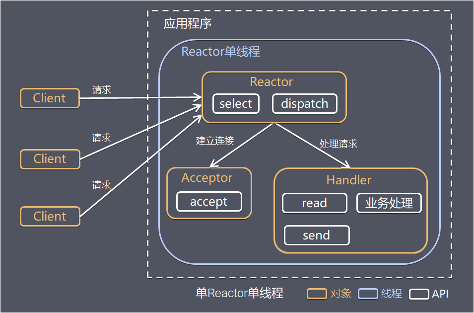
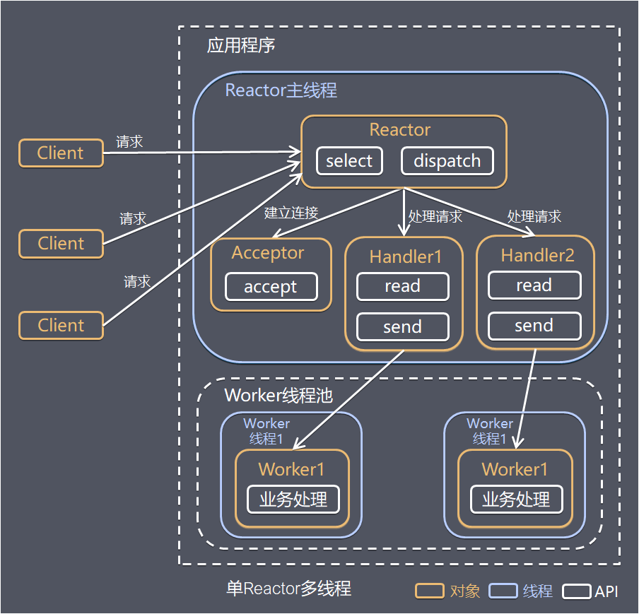
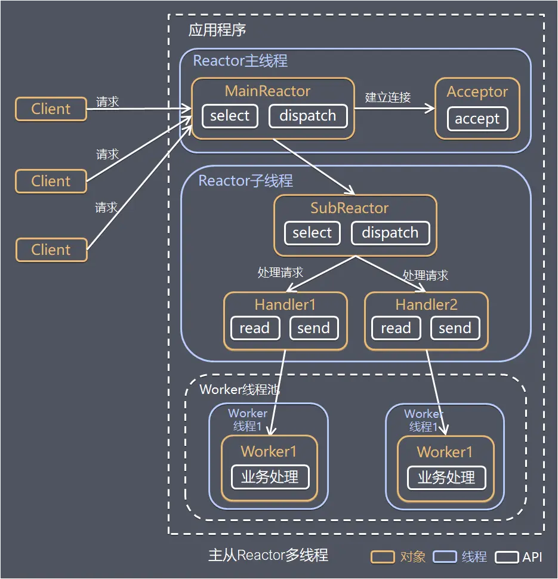
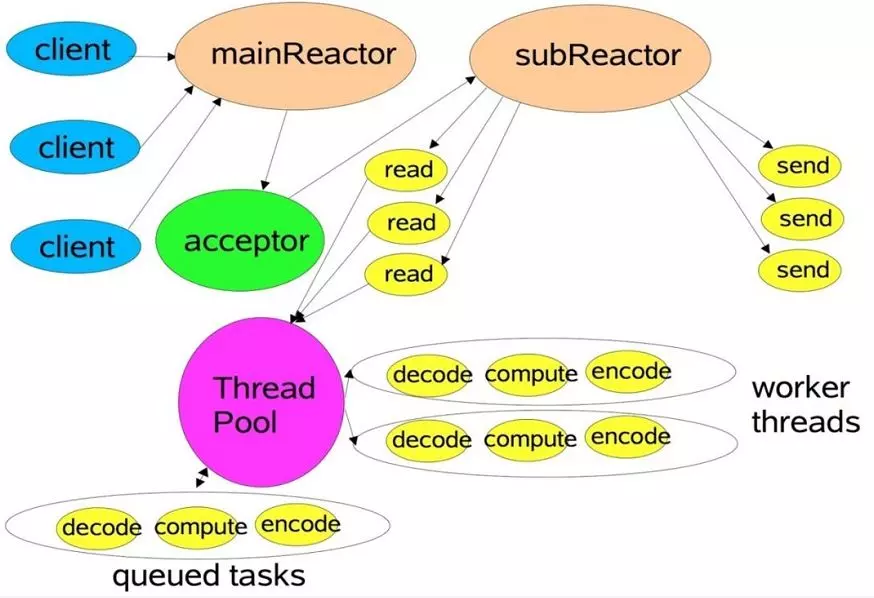
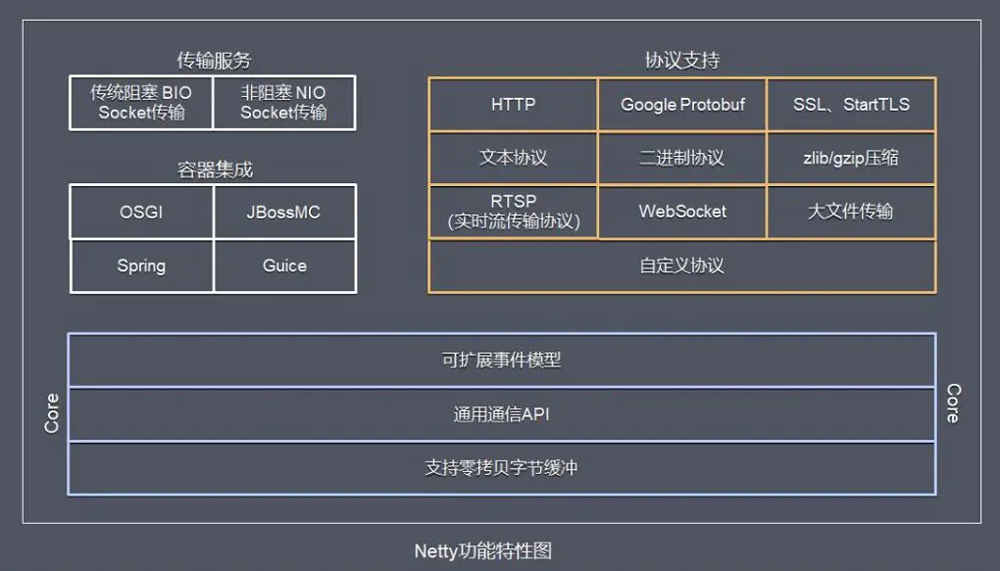
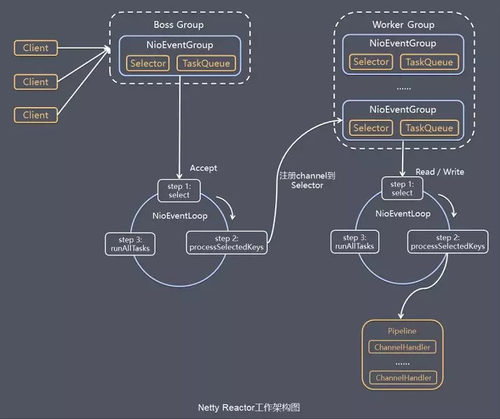
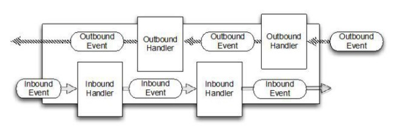
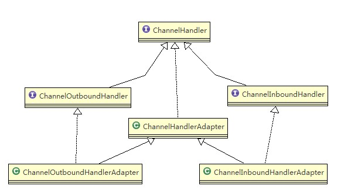
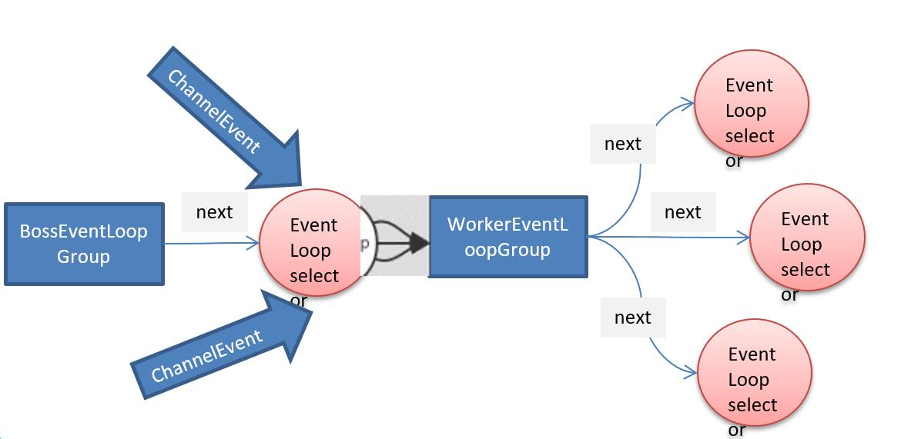

# Netty

## 原生IO存在的问题
- NIO 的类库和 API 繁杂，使用麻烦：需要熟练掌握 Selector、ServerSocketChannel、SocketChannel、ByteBuffer 等
- 需要具备其他的额外技能：要熟悉 Java 多线程编程，因为 NIO 编程涉及到 Reactor 模式，你必须对多线程和网络编程非常熟悉，才能编写出高质量的 NIO 程序
- 开发工作量和难度都非常大：例如客户端面临断连重连、网络闪断、半包读写、失败缓存、网络拥塞和异常流的处理等等
- JDK NIO 的 Bug：例如臭名昭著的 Epoll Bug，它会导致 Selector 空轮询，最终导致 CPU 100%。直到 JDK 1.7 版本该问题仍旧存在，没有被根本解决。

## Netty简介
- Netty is an asynchronous event-driven network application framework
  for rapid development of maintainable high performance protocol servers & clients.

- core 说明
    - 零拷贝
    - 通用交互API
    - 可扩展的事件模型
    
##Netty高性能的架构设计

**线程模型介绍**
- 目前存在的线程模型有：
    - 传统阻塞 I/O 服务模型 
    - Reactor模式
- 根据 Reactor 的数量和处理资源池线程的数量不同，有 3 种典型的实现
    - 单 Reactor 单线程
    - 单 Reactor 多线程
    - 主从 Reactor 多线程 
- Netty 线程模式(Netty 主要基于主从 Reactor 多线程模型做了一定的改进，其中主从 Reactor 多线程模型有多个 Reactor)

- [网络模型](网络模型.md)

**单Reactor单线程**

- 方案说明
1. Select 是前面 I/O 复用模型介绍的标准网络编程 API，可以实现应用程序通过一个阻塞对象监听多路连接请求
2. Reactor 对象通过 Select 监控客户端请求事件，收到事件后通过 Dispatch 进行分发
3. 如果是建立连接请求事件，则由 Acceptor 通过 Accept 处理连接请求，然后创建一个 Handler 对象处理连接完成后的后续业务处理
4. 如果不是建立连接事件，则 Reactor 会分发调用连接对应的 Handler 来响应
4. Handler 会完成 Read→业务处理→Send 的完整业务流程

- 方案优缺点分析：
    - 优点：模型简单，没有多线程、进程通信、竞争的问题，全部都在一个线程中完成
    - 缺点：性能问题，只有一个线程，无法完全发挥多核 CPU 的性能。Handler 在处理某个连接上的业务时，整个进程无法处理其他连接事件，很容易导致性能瓶颈
    - 缺点：可靠性问题，线程意外终止，或者进入死循环，会导致整个系统通信模块不可用，不能接收和处理外部消息，造成节点故障
    - 使用场景：客户端的数量有限，业务处理非常快速，比如 Redis在业务处理的时间复杂度 O(1) 的情况
    
**单Reactor多线程**

- 方案说明
1. Reactor 对象通过select 监控客户端请求事件, 收到事件后，通过dispatch进行分发
2. 如果建立连接请求, 则右Acceptor 通过accept 处理连接请求, 然后创建一个Handler对象处理完成连接后的各种事件
3. 如果不是连接请求，则由reactor分发调用连接对应的handler 来处理
4. handler 只负责响应事件，不做具体的业务处理, 通过read 读取数据后，会分发给后面的worker线程池的某个线程处理业务
5. worker 线程池会分配独立线程完成真正的业务，并将结果返回给handler
6. handler收到响应后，通过send 将结果返回给client

- 优缺点分析
    - 优点：可以充分的利用多核cpu 的处理能力
    - 缺点：多线程数据共享和访问比较复杂， reactor 处理所有的事件的监听和响应，在单线程运行， 在高并发场景容易出现性能瓶颈.

**主从Reactor多线程**

- 方案说明
1. Reactor主线程 MainReactor 对象通过select 监听连接事件, 收到事件后，通过Acceptor 处理连接事件
2. 当 Acceptor  处理连接事件后，MainReactor 将连接分配给SubReactor
3. subreactor 将连接加入到连接队列进行监听,并创建handler进行各种事件处理
4. 当有新事件发生时， subreactor 就会调用对应的handler处理
5. handler 通过read 读取数据，分发给后面的worker 线程处理
6. worker 线程池分配独立的worker 线程进行业务处理，并返回结果
7. handler 收到响应的结果后，再通过send 将结果返回给client
8. Reactor 主线程可以对应多个Reactor 子线程, 即MainRecator 可以关联多个SubReactor

- 方案优缺点说明：
    - 优点：父线程与子线程的数据交互简单职责明确，父线程只需要接收新连接，子线程完成后续的业务处理。
    - 优点：父线程与子线程的数据交互简单，Reactor 主线程只需要把新连接传给子线程，子线程无需返回数据。
    - 缺点：编程复杂度较高

##Netty线程模型
Netty 主要基于主从 Reactors 多线程模型（如下图）做了一定的修改，其中主从 Reactor 多线程模型有多个 Reactor：
- MainReactor 负责客户端的连接请求，并将请求转交给 SubReactor
- SubReactor 负责相应通道的 IO 读写请求
- 非 IO 请求（具体逻辑处理）的任务则会直接写入队列，等待 worker threads 进行处理

这里引用 Doug Lee 大神的 Reactor 介绍：Scalable IO in Java 里面关于主从 Reactor 多线程模型的图:


**特别说明的是**：虽然 Netty 的线程模型基于主从 Reactor 多线程，借用了 MainReactor 和 SubReactor 的结构。但是实际实现上 SubReactor 和 Worker 线程在同一个线程池中

- bossGroup 线程池则只是在 Bind 某个端口后，获得其中一个线程作为 MainReactor，专门处理端口的 Accept 事件，每个端口对应一个 Boss 线程。
- workerGroup 线程池会被各个 SubReactor 和 Worker 线程充分利用。

## Netty功能特性图


## Netty模块组件

**Bootstrap、ServerBootstrap**

Bootstrap 意思是引导，一个 Netty 应用通常由一个 Bootstrap 开始，主要作用是配置整个 Netty 程序，串联各个组件，Netty 中 Bootstrap 类是客户端程序的启动引导类，ServerBootstrap 是服务端启动引导类。

**Future、ChannelFuture**

正如前面介绍，在 Netty 中所有的 IO 操作都是异步的，不能立刻得知消息是否被正确处理。

但是可以过一会等它执行完成或者直接注册一个监听，具体的实现就是通过 Future 和 ChannelFutures，他们可以注册一个监听，当操作执行成功或失败时监听会自动触发注册的监听事件。

**Channel**

Netty 网络通信的组件，能够用于执行网络 I/O 操作。Channel 为用户提供：
- 当前网络连接的通道的状态（例如是否打开？是否已连接？）
- 网络连接的配置参数 （例如接收缓冲区大小）
- 提供异步的网络 I/O 操作(如建立连接，读写，绑定端口)，异步调用意味着任何 I/O 调用都将立即返回，并且不保证在调用结束时所请求的 I/O 操作已完成。    调用立即返回一个 ChannelFuture 实例，通过注册监听器到 ChannelFuture 上，可以 I/O 操作成功、失败或取消时回调通知调用方。
- 支持关联 I/O 操作与对应的处理程序。

不同协议、不同的阻塞类型的连接都有不同的 Channel 类型与之对应。下面是一些常用的 Channel 类型：

- NioSocketChannel，异步的客户端 TCP Socket 连接。
- NioServerSocketChannel，异步的服务器端 TCP Socket 连接。
- NioDatagramChannel，异步的 UDP 连接。
- NioSctpChannel，异步的客户端 Sctp 连接。
- NioSctpServerChannel，异步的 Sctp 服务器端连接，这些通道涵盖了 UDP 和 TCP 网络 IO 以及文件 IO。

**Selector**

Netty 基于 Selector 对象实现 I/O 多路复用，通过 Selector 一个线程可以监听多个连接的 Channel 事件。

当向一个 Selector 中注册 Channel 后，Selector 内部的机制就可以自动不断地查询(Select) 这些注册的 Channel 是否有已就绪的 I/O 事件（例如可读，可写，网络连接完成等），这样程序就可以很简单地使用一个线程高效地管理多个 Channel 。

**NioEventLoop**

NioEventLoop 中维护了一个线程和任务队列，支持异步提交执行任务，线程启动时会调用 NioEventLoop 的 run 方法，执行 I/O 任务和非 I/O 任务：

- I/O 任务，即 selectionKey 中 ready 的事件，如 accept、connect、read、write 等，由 processSelectedKeys 方法触发。
- 非 IO 任务，添加到 taskQueue 中的任务，如 register0、bind0 等任务，由 runAllTasks 方法触发。

两种任务的执行时间比由变量 ioRatio 控制，默认为 50，则表示允许非 IO 任务执行的时间与 IO 任务的执行时间相等。

**NioEventLoopGroup**

NioEventLoopGroup，主要管理 eventLoop 的生命周期，可以理解为一个线程池，内部维护了一组线程，每个线程(NioEventLoop)负责处理多个 Channel 上的事件，而一个 Channel 只对应于一个线程。

**ChannelHandler**
ChannelHandler 是一个接口，处理 I/O 事件或拦截 I/O 操作，并将其转发到其 ChannelPipeline(业务处理链)中的下一个处理程序。

ChannelHandler 本身并没有提供很多方法，因为这个接口有许多的方法需要实现，方便使用期间，可以继承它的子类：

- ChannelInboundHandler 用于处理入站 I/O 事件。
- ChannelOutboundHandler 用于处理出站 I/O 操作。

或者使用以下适配器类：

- ChannelInboundHandlerAdapter 用于处理入站 I/O 事件。
- ChannelOutboundHandlerAdapter 用于处理出站 I/O 操作。
- ChannelDuplexHandler 用于处理入站和出站事件。

**ChannelHandlerContext**

保存 Channel 相关的所有上下文信息，同时关联一个 ChannelHandler 对象。

**ChannelPipline**

保存 ChannelHandler 的 List，用于处理或拦截 Channel 的入站事件和出站操作。

ChannelPipeline 实现了一种高级形式的拦截过滤器模式，使用户可以完全控制事件的处理方式，以及 Channel 中各个的 ChannelHandler 如何相互交互。

I/O 事件由 ChannelInboundHandler 或 ChannelOutboundHandler 处理，并通过调用 ChannelHandlerContext 中定义的事件传播方法。

## Netty工作架构图



服务端 Netty Reactor 工作架构图

Server 端包含 1 个 Boss NioEventLoopGroup 和 1 个 Worker NioEventLoopGroup。

NioEventLoopGroup 相当于 1 个事件循环组，这个组里包含多个事件循环 NioEventLoop，每个 NioEventLoop 包含 1 个 Selector 和 1 个事件循环线程。

每个 Boss NioEventLoop 循环执行的任务包含 3 步：
- **轮询 Accept 事件**
- **处理 Accept I/O 事件**，与 Client 建立连接，生成 NioSocketChannel，并将 NioSocketChannel 注册到某个 Worker NioEventLoop 的 Selector 上。
- **处理任务队列中的任务，runAllTasks。**任务队列中的任务包括用户调用 eventloop.execute 或 schedule 执行的任务，或者其他线程提交到该 eventloop 的任务

每个 Worker NioEventLoop 循环执行的任务包含 3 步：
- 轮询 Read、Write 事件。
- 处理 I/O 事件，即 Read、Write 事件，在 NioSocketChannel 可读、可写事件发生时进行处理。
- 处理任务队列中的任务，runAllTasks。


**说明**
1. Netty抽象出两组线程池 BossGroup 专门负责接收客户端的连接;  WorkerGroup 专门负责网络的读写
2. BossGroup 和 WorkerGroup 类型都是 NioEventLoopGroup
3. NioEventLoopGroup 相当于一个事件循环组, 这个组中含有多个事件循环 ，每一个事件循环是 NioEventLoop
4. NioEventLoop表示一个不断循环处理任务的线程，每个NioEventLoop都有一个selector，用于监听绑定在其上的socket网络通讯
5. NioEventLoopGroup 可以含有多个线程，即可以含有多个NioEventLoop
6. 每个Boss NioEventLoopGroup 的执行步骤有3个
    1. 轮询accept事件
    2. 处理accept事件，与client建立连接，生成NioSocketChannel，并将其注册到某个worker NioEventLoop上的selector
    3. 处理任务任务队列的任务 即runAllTasks
7. 分析Worker，每个Workder NioEventLoopGroup 循环执行的步骤
    1. 轮询read write事件
    2. 处理i/o事件，即read,write事件，在对应的NioSocketChannel上处理
    3. 处理任务任务队列的任务 即runAllTasks
8. 每个worker NioEventLoop 处理业务的时候，会使用pipline，每个pipline中包含了channel，即可以通过pipline获取到channel，管道中维护了很多的handler

**Netty模型方案再说明**
1. Netty抽象出两组线程池，BossGroup专门负责接收客户端连接，WorkerGroup专门负责网络读写操作
2. NioEventLoop 表示一个不断循环执行处理任务的线程，每个NioEvenetLoop都有一个selector,用于监听绑定在其上的socket网络通道
3. NioEventLoop 内部采用串行化设计，从消息的读取->解码->处理->编码->发送，始终由IO线程NioEventLoop负责

- NioEventLoopGroup 下包含多个 NioEventLoop
- 每个 NioEventLoop 都包含有一个 Selector 一个 taskQueue
- 每个 NioEventLoop 的 Selector 上可以注册监听多个 NioChannel
- 每个 NioChannel 只会绑定在唯一的 NioEventLoop上
- 每个 NioChannel 都绑定有一个自己的 ChannelPipeline

## 异步模型

**异步模型**
1. 异步的概念和同步相对。当一个异步过程调用发出后，调用者不能立刻得到结果。实际处理这个调用的组件在完成后，通过状态、通知和回调来通知调用者。
2. Netty 中的 I/O 操作是异步的，包括 Bind、Write、Connect 等操作会简单的返回一个 ChannelFuture。
3. 调用者并不能立刻获得结果，而是通过 Future-Listener 机制，用户可以方便的主动获取或者通过通知机制获得 IO 操作结果
4. Netty 的异步模型是建立在 future 和 callback 的之上的。callback 就是回调。重点说 Future，它的核心思想是：假设一个方法 fun，计算过程可能非常耗时，等待 fun返回显然不合适。那么可以在调用 fun 的时候，立马返回一个 Future，后续可以通过 Future去监控方法 fun 的处理过程(即 ： Future-Listener 机制)

**Future说明**
1. 表示异步的执行结果, 可以通过它提供的方法来检测执行是否完成，比如检索计算等等.
2. `ChannelFuture` 是一个接口 ： `public interface ChannelFuture extends Future<Void>`我们可以添加监听器，当监听的事件发生时，就会通知到监听器. 案例说明

**工作原理示意图**



1. 在使用 Netty 进行编程时，拦截操作和转换出入站数据只需要您提供 callback 或利用future 即可。这使得链式操作简单、高效, 并有利于编写可重用的、通用的代码
2. Netty 框架的目标就是让你的业务逻辑从网络基础应用编码中分离出来、解脱出来

**Future-Listener机制**
1. 当 Future 对象刚刚创建时，处于非完成状态，调用者可以通过返回的 ChannelFuture 来获取操作执行的状态，注册监听函数来执行完成后的操作。
2. 常见有如下操作
    - 通过 isDone 方法来判断当前操作是否完成
    - 通过 isSuccess 方法来判断已完成的当前操作是否成功
    - 通过 getCause 方法来获取已完成的当前操作失败的原因
    - 通过 isCancelled 方法来判断已完成的当前操作是否被取消
    - 通过 addListener 方法来注册监听器，当操作已完成(isDone 方法返回完成)，将会通知指定的监听器；如果 Future 对象已完成，则通知指定的监听器
3. 总结： 相比传统阻塞 I/O，执行 I/O 操作后线程会被阻塞住, 直到操作完成；异步处理的好处是不会造成线程阻塞，线程在 I/O 操作期间可以执行别的程序，在高并发情形下会更稳定和更高的吞吐量

## Netty核心模块组件

**Bootstrap ServerBootstrap**
1. Bootstrap 意思是引导，一个 Netty 应用通常由一个 Bootstrap 开始，主要作用是配置整个 Netty 程序，串联各个组件，Netty 中 Bootstrap 类是客户端程序的启动引导类，ServerBootstrap 是服务端启动引导类
2. 常见的方法有
- `public ServerBootstrap group(EventLoopGroup parentGroup, EventLoopGroup childGroup)`，该方法用于服务器端，用来设置两个 EventLoop
- `public B group(EventLoopGroup group) `，该方法用于客户端，用来设置一个 EventLoop
- `public B channel(Class<? extends C> channelClass)`，该方法用来设置一个服务器端的通道实现
- `public <T> B option(ChannelOption<T> option, T value)`，用来给 ServerChannel 添加配置
- `public <T> ServerBootstrap childOption(ChannelOption<T> childOption, T value)`，用来给接收到的通道添加配置
- `public ServerBootstrap childHandler(ChannelHandler childHandler)`，该方法用来设置业务处理类（自定义的 handler）`handler(..)`给bossGroup使用,`childHandler(...)`给workerGroup使用
- `public ChannelFuture bind(int inetPort) `，该方法用于服务器端，用来设置占用的端口号
- `public ChannelFuture connect(String inetHost, int inetPort)` ，该方法用于客户端，用来连接服务器端

**Future、ChannelFuture**
1. Netty 中所有的 IO 操作都是异步的，不能立刻得知消息是否被正确处理。但是可以过一会等它执行完成或者直接注册一个监听，具体的实现就是通过 Future 和 ChannelFutures，他们可以注册一个监听，当操作执行成功或失败时监听会自动触发注册的监听事件
2. 常见的方法有
- `Channel channel()`，返回当前正在进行 IO 操作的通道
- `ChannelFuture sync()`，等待异步操作执行完毕

**Channel**
1. Netty 网络通信的组件，能够用于执行网络 I/O 操作。
2. 通过Channel 可获得当前网络连接的通道的状态
3. 通过Channel 可获得 网络连接的配置参数 （例如接收缓冲区大小）
4. Channel 提供异步的网络 I/O 操作(如建立连接，读写，绑定端口)，异步调用意味着任何 I/O 调用都将立即返回，并且不保证在调用结束时所请求的 I/O 操作已完成
5. 调用立即返回一个 ChannelFuture 实例，通过注册监听器到 ChannelFuture 上，可以 I/O 操作成功、失败或取消时回调通知调用方
6. 支持关联 I/O 操作与对应的处理程序
7. 不同协议、不同的阻塞类型的连接都有不同的 Channel 类型与之对应，常用的 Channel 类型:
    - NioSocketChannel，异步的客户端 TCP Socket 连接。
    - NioServerSocketChannel，异步的服务器端 TCP Socket 连接。
    - NioDatagramChannel，异步的 UDP 连接。
    - NioSctpChannel，异步的客户端 Sctp 连接。
    - NioSctpServerChannel，异步的 Sctp 服务器端连接，这些通道涵盖了 UDP 和 TCP 网络 IO 以及文件 IO。

**Selector**
1. Netty 基于 Selector 对象实现 I/O 多路复用，通过 Selector 一个线程可以监听多个连接的 Channel 事件。
2. 当向一个 Selector 中注册 Channel 后，Selector 内部的机制就可以自动不断地查询(Select) 这些注册的 Channel 是否有已就绪的 I/O 事件（例如可读，可写，网络连接完成等），这样程序就可以很简单地使用一个线程高效地管理多个 Channel 

**ChannelHandler 及其实现类**
1. ChannelHandler 是一个接口，处理 I/O 事件或拦截 I/O 操作，并将其转发到其 ChannelPipeline(业务处理链)中的下一个处理程序。
2. ChannelHandler 本身并没有提供很多方法，因为这个接口有许多的方法需要实现，方便使用期间，可以继承它的子类
3. ChannelHandler 及其实现类一览图

    - ChannelInboundHandler 用于处理入站 I/O 事件。
    - ChannelOutboundHandler 用于处理出站 I/O 操作。
    - ChannelInboundHandlerAdapter 用于处理入站 I/O 事件。
    - ChannelOutboundHandlerAdapter 用于处理出站 I/O 操作。
    - ChannelDuplexHandler 用于处理入站和出站事件。
4. 我们经常需要自定义一个 Handler 类去继承 ChannelInboundHandlerAdapter，然后通过重写相应方法实现业务逻辑，我们接下来看看一般都需要重写哪些方法
```java
public class ChannelInboundHandlerAdapter extends ChannelHandlerAdapter implements ChannelInboundHandler {

    public void channelRegistered(ChannelHandlerContext ctx) throws Exception {
        ctx.fireChannelRegistered();
    }

    public void channelUnregistered(ChannelHandlerContext ctx) throws Exception {
        ctx.fireChannelUnregistered();
    }

    /**
     * 通道就绪事件
     */
    public void channelActive(ChannelHandlerContext ctx) throws Exception {
        ctx.fireChannelActive();
    }

    public void channelInactive(ChannelHandlerContext ctx) throws Exception {
        ctx.fireChannelInactive();
    }

    /**
     * 通道读取数据事件 
     */
    public void channelRead(ChannelHandlerContext ctx, Object msg) throws Exception {
        ctx.fireChannelRead(msg);
    }

    /**
     * 数据读取完毕事件
     */
    public void channelReadComplete(ChannelHandlerContext ctx) throws Exception {
        ctx.fireChannelReadComplete();
    }

    public void userEventTriggered(ChannelHandlerContext ctx, Object evt) throws Exception {
        ctx.fireUserEventTriggered(evt);
    }

    public void channelWritabilityChanged(ChannelHandlerContext ctx) throws Exception {
        ctx.fireChannelWritabilityChanged();
    }

    /**
     * 通道发生异常事件
     */
    public void exceptionCaught(ChannelHandlerContext ctx, Throwable cause)
            throws Exception {
        ctx.fireExceptionCaught(cause);
    }
}
```

**ChannelHandlerContext**
1. 保存 Channel 相关的所有上下文信息，同时关联一个 ChannelHandler 对象
2. 即ChannelHandlerContext 中包含一个具体的事件处理器 ChannelHandler ， 同时ChannelHandlerContext 中也绑定了对应的 pipeline 和 Channel 的信息，方便对 ChannelHandler进行调用.
3. 常用方法
    - `ChannelFuture close()`，关闭通道
    - `ChannelOutboundInvoker flush()`，刷新
    - `ChannelFuture writeAndFlush(Object msg)` ， 将 数 据 写 到 ChannelPipeline 中 当 前
    - `ChannelHandler` 的下一个 `ChannelHandler` 开始处理（出站）

**ChannelOption**

1. Netty 在创建 Channel 实例后,一般都需要设置 ChannelOption 参数
2. ChannelOption 参数如下
```text
ChannelOption.SO_BACKLOG
对应 TCP/IP 协议 listen 函数中的 backlog 参数，用来初始化服务器可连接队列大小。服
务端处理客户端连接请求是顺序处理的，所以同一时间只能处理一个客户端连接。多个客户
端来的时候，服务端将不能处理的客户端连接请求放在队列中等待处理，backlog 参数指定
了队列的大小。

ChannelOption.SO_KEEPALIVE
一直保持连接活动状态
```

**EventLoopGroup 和其实现类 NioEventLoopGroup**
1. EventLoopGroup 是一组 EventLoop 的抽象，Netty 为了更好的利用多核 CPU 资源，一般会有多个 EventLoop 同时工作，每个 EventLoop 维护着一个 Selector 实例
2. EventLoopGroup 提供 next 接口，可以从组里面按照一定规则获取其中一个 EventLoop来处理任务。在 Netty 服务器端编程中，我们一般都需要提供两个 EventLoopGroup，例如：BossEventLoopGroup 和 WorkerEventLoopGroup
3. 通常一个服务端口即一个 ServerSocketChannel对应一个Selector 和一个EventLoop线程。BossEventLoop 负责接收客户端的连接并将 SocketChannel 交给 WorkerEventLoopGroup 来进行 IO 处理

    - BossEventLoopGroup 通常是一个单线程的 EventLoop，EventLoop 维护着一个注册了ServerSocketChannel 的 Selector 实例BossEventLoop 不断轮询 Selector 将连接事件分离出来
    - 通常是 OP_ACCEPT 事件，然后将接收到的 SocketChannel 交给 WorkerEventLoopGroup
    - WorkerEventLoopGroup 会由 next 选择其中一个 EventLoop来将这个 SocketChannel 注册到其维护的 Selector 并对其后续的 IO 事件进行处理
4. 常用方法
    - `public NioEventLoopGroup()`，构造方法
    - `public Future<?> shutdownGracefully()`，断开连接，关闭线程

**Unpooled类**
1. Netty 提供一个专门用来操作缓冲区(即Netty的数据容器)的工具类
2. 常用方法如下所示
```java
//通过给定的数据和字符编码返回一个 ByteBuf 对象（类似于 NIO 中的 ByteBuffer 但有区别）
public static ByteBuf copiedBuffer(CharSequence string, Charset charset)
```
