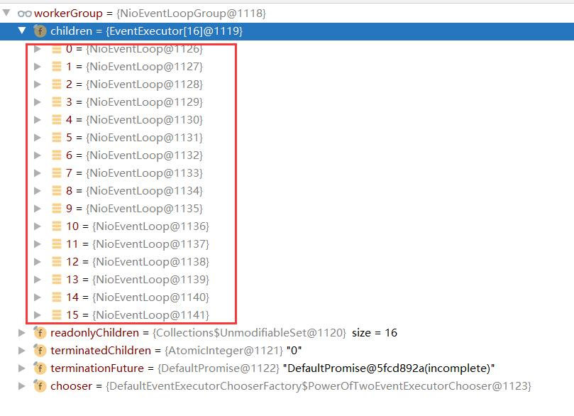

## Netty启动过程源码
```text
EventLoopGroup bossGroup = new NioEventLoopGroup(1);
EventLoopGroup workerGroup = new NioEventLoopGroup();
```
1. 这两个对象是netty的核心对象
    - `boosGroup` 用与接收TCP请求，它会将请求交给 `workerGroup`
    - `workerGroup` 会获取到真正的连接，然后和连接进行通信
        - 比如读、写或者编码、解码操作
2. `EventLoopGroup` 是事件循环组（线程组），含有多个EventLoop，可以注册`Channel`,用于在事件循环组中取选择(和选择器相关)

    
3. `new NioEventLoopGroup(1)` 这个 `1` 表示 `bossGroup` 事件组中有一个线程你可以指定，如果是`new NioEventLoopGroup()` 会含有`默认CPU核数*2` 充分利用多核优势

    

    
4. 