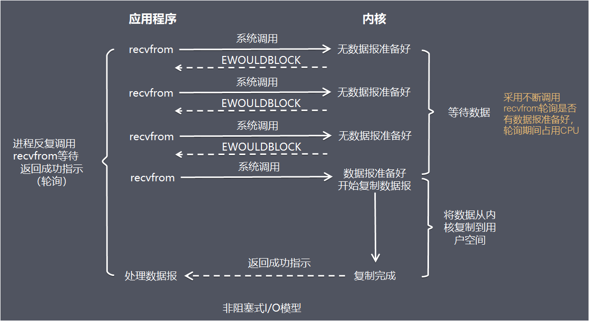
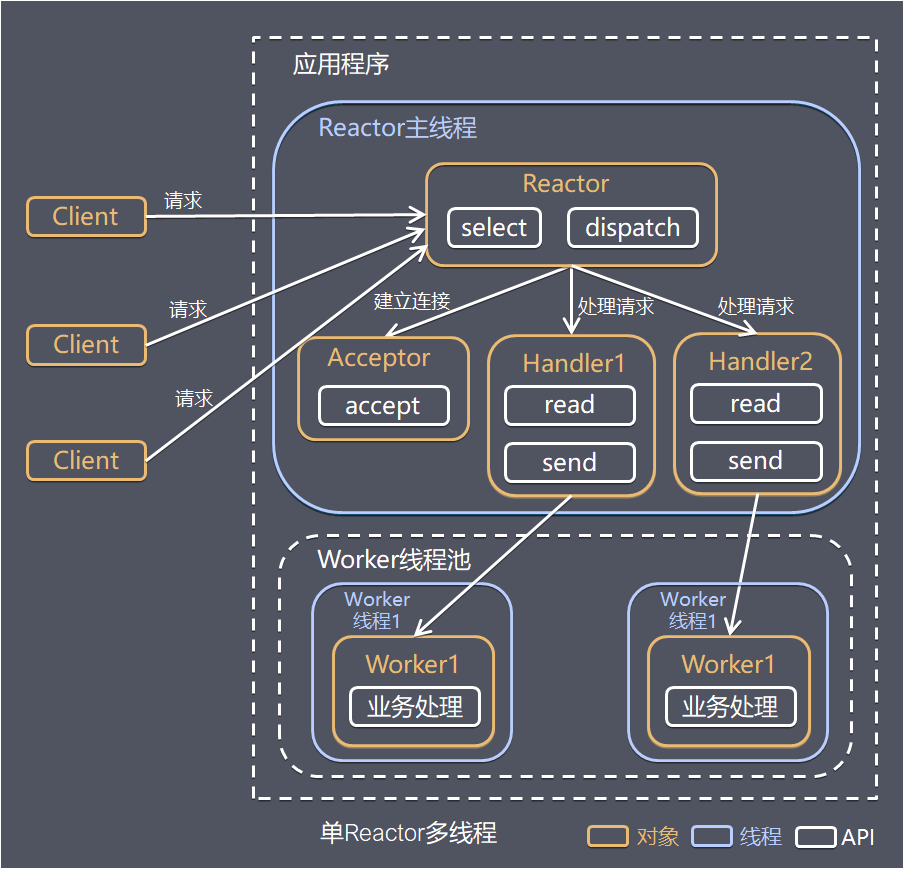

# 服务端处理网络请求
- 服务端处理网络请求的典型过程

 
- 主要处理步骤包括
    1. 获取请求数据 客户端与服务器建立连接发出请求，服务器接受请求（1-3）
    2. 构建响应 当服务器接收完请求，并在用户空间处理客户端的请求，直到构建响应完成（4）
    3. 返回数据 服务器将已构建好的响应再通过内核空间的网络I/O发还给客户端（5-7）
- 设计服务端并发模型时，主要有如下两个关键点
    - 服务器如何管理连接，获取输入数据
    - 服务器如何处理请求
    
# I/O 模型
## 概念理论
介绍操作系统的I/O模型之前，先了解一下几个概念
- 阻塞调用与非阻塞调用
    - 阻塞调用是指调用结果返回之前，当前线程会被挂起。调用线程只有在得到结果之后才会返回
    - 非阻塞调用指在不能立刻得到结果之前，该调用不会阻塞当前线程
    > 两者的最大区别在于被调用方在收到请求到返回结果之前的这段时间内，调用方是否一直在等待。阻塞是指调用方一直在等待而且别的事情什么都不做。非阻塞是指调用方先去忙别的事情
- 同步处理与异步处理
    - 同步处理是指被调用方得到最终结果之后才返回给调用方
    - 异步处理是指被调用方先返回应答，然后再计算调用结果，计算完最终结果后再通知并返回给调用方
- 阻塞、非阻塞和同步、异步的区别 阻塞、非阻塞和同步、异步其实针对的对象是不一样的
    > 阻塞、非阻塞的讨论对象是调用者 同步、异步的讨论对象是被调用者
- recvfrom函数 recvfrom函数(经socket接收数据)，这里把它视为系统调用
- 一个输入操作通常包括两个不同的阶段
    - 等待数据准备好
    - 从内核向进程复制数据
> 对于一个套接字上的输入操作，第一步通常涉及等待数据从网络中到达。当所等待分组到达时，它被复制到内核中的某个缓冲区。第二步就是把数据从内核缓冲区复制到应用进程缓冲区

---
# 5种模型
实际应用程序在系统调用完成上面2步操作时，调用方式的阻塞、非阻塞，操作系统在处理应用程序请求时处理方式的同步、异步处理的不同，参考**《UNIX网络编程卷1》**，可以分为5种I/O模型
## 阻塞式I/O模型(blocking I/O)

- 简介： 在阻塞式I/O模型中，应用程序在从调用recvfrom开始到它返回有数据报准备好这段时间是阻塞的，recvfrom返回成功后，应用进程开始处理数据报
- 比喻： 一个人在钓鱼，当没鱼上钩时，就坐在岸边一直等
- 优点： 程序简单，在阻塞等待数据期间进程/线程挂起，基本不会占用CPU资源
- 缺点：  每个连接需要独立的进程/线程单独处理，当并发请求量大时为了维护程序，内存、线程切换开销较大，这种模型在实际生产中很少使用
## 非阻塞式I/O模型(non-blocking I/O）

- 简介 在非阻塞式I/O模型中，应用程序把一个套接口设置为非阻塞就是告诉内核，当所请求的I/O操作无法完成时，不要将进程睡眠，而是返回一个错误，应用程序基于I/O操作函数将不断的轮询数据是否已经准备好，如果没有准备好，继续轮询，直到数据准备好为止
- 比喻 边钓鱼边玩手机，隔会再看看有没有鱼上钩，有的话就迅速拉杆
- 优点 不会阻塞在内核的等待数据过程，每次发起的I/O请求可以立即返回，不用阻塞等待，实时性较好
- 缺点 轮询将会不断地询问内核，这将占用大量的CPU时间，系统资源利用率较低，所以一般Web服务器不使用这种I/O模型

##  I/O复用模型(I/O multiplexing)

- 简介: 在I/O复用模型中，会用到select或poll函数或epoll函数(Linux2.6以后的内核开始支持)，这两个函数也会使进程阻塞，但是和阻塞I/O所不同的的，这两个函数可以同时阻塞多个I/O操作，而且可以同时对多个读操作，多个写操作的I/O函数进行检测，直到有数据可读或可写时，才真正调用I/O操作函数
- 比喻: 放了一堆鱼竿，在岸边一直守着这堆鱼竿，直到有鱼上钩
- 优点: 可以基于一个阻塞对象，同时在多个描述符上等待就绪，而不是使用多个线程(每个文件描述符一个线程)，这样可以大大节省系统资源
- 缺点: 当连接数较少时效率相比多线程+阻塞I/O模型效率较低，可能延迟更大，因为单个连接处理需要2次系统调用，占用时间会有增加

## 信号驱动式I/O模型（signal-driven I/O)

- 简介: 在信号驱动式I/O模型中，应用程序使用套接口进行信号驱动I/O，并安装一个信号处理函数，进程继续运行并不阻塞。当数据准备好时，进程会收到一个SIGIO信号，可以在信号处理函数中调用I/O操作函数处理数据
- 比喻: 鱼竿上系了个铃铛，当铃铛响，就知道鱼上钩，然后可以专心玩手机
- 优点: 线程并没有在等待数据时被阻塞，可以提高资源的利用率
- 缺点:
    - 信号I/O在大量IO操作时可能会因为信号队列溢出导致没法通知
    - 信号驱动I/O尽管对于处理UDP套接字来说有用，即这种信号通知意味着到达一个数据报，或者返回一个异步错误。但是，对于TCP而言，信号驱动的I/O方式近乎无用，因为导致这种通知的条件为数众多，每一个来进行判别会消耗很大资源，与前几种方式相比优势尽失

## 异步I/O模型（asynchronous I/O）

- 简介: 由POSIX规范定义，应用程序告知内核启动某个操作，并让内核在整个操作（包括将数据从内核拷贝到应用程序的缓冲区）完成后通知应用程序。这种模型与信号驱动模型的主要区别在于：信号驱动I/O是由内核通知应用程序何时启动一个I/O操作，而异步I/O模型是由内核通知应用程序I/O操作何时完成
- 优点: 异步 I/O 能够充分利用 DMA 特性，让 I/O 操作与计算重叠
- 缺点: 要实现真正的异步 I/O，操作系统需要做大量的工作。目前 Windows 下通过 IOCP 实现了真正的异步 I/O，而在 Linux 系统下，Linux2.6才引入，目前 AIO 并不完善，因此在 Linux 下实现高并发网络编程时都是以 IO复用模型模式为主。

---
## 5种I/O模型总结

- 从上图中我们可以看出，可以看出，越往后，阻塞越少，理论上效率也是最优。其五种I/O模型中，前四种属于同步I/O，因为其中真正的I/O操作(recvfrom)将阻塞进程/线程，只有异步I/O模型才于POSIX定义的异步I/O相匹配

# 线程模型
介绍完服务器如何基于I/O模型管理连接，获取输入数据，下面介绍基于进程/线程模型，服务器如何处理请求

值得说明的是，具体选择线程还是进程，更多是与平台及编程语言相关，例如C语言使用线程和进程都可以(例如Nginx使用进程，Memcached使用线程)，Java语言一般使用线程(例如Netty)，为了描述方便，下面都使用线程来进程描述

## 传统阻塞I/O服务模型

- 特点
    - 采用阻塞式I/O模型获取输入数据
    - 每个连接都需要独立的线程完成数据输入，业务处理，数据返回的完整操作
- 存在问题
    - 当并发数较大时，需要创建大量线程来处理连接，系统资源占用较大
    - 连接建立后，如果当前线程暂时没有数据可读，则线程就阻塞在read操作上，造成线程资源浪费

## Reactor模式
针对传统传统阻塞I/O服务模型的2个缺点，比较常见的有如下解决方案：
- 基于I/O复用模型，多个连接共用一个阻塞对象，应用程序只需要在一个阻塞对象上等待，无需阻塞等待所有连接。当某条连接有新的数据可以处理时，操作系统通知应用程序，线程从阻塞状态返回，开始进行业务处理
- 基于线程池复用线程资源，不必再为每个连接创建线程，将连接完成后的业务处理任务分配给线程进行处理，一个线程可以处理多个连接的业务

I/O复用结合线程池，这就是Reactor模式基本设计思想

**Reactor模式**，是指通过一个或多个输入同时传递给服务处理器的服务请求的事件驱动处理模式。 服务端程序处理传入多路请求，并将它们同步分派给请求对应的处理线程，Reactor模式也叫Dispatcher模式，即I/O多了复用统一监听事件，收到事件后分发(Dispatch给某进程)，是编写高性能网络服务器的必备技术之一

Reactor模式中有2个关键组成：
- Reactor在一个单独的线程中运行，负责监听和分发事件，分发给适当的处理程序来对IO事件做出反应。 它就像公司的电话接线员，它接听来自客户的电话并将线路转移到适当的联系人
- Handlers 处理程序执行I/O事件要完成的实际事件，类似于客户想要与之交谈的公司中的实际官员。Reactor通过调度适当的处理程序来响应I/O事件，处理程序执行非阻塞操作

根据Reactor的数量和处理资源池线程的数量不同，有3种典型的实现：
- 单Reactor单线程
- 单Reactor多线程
- 主从Reactor多线程

### 单Reactor单线程

其中，select是前面I/O复用模型介绍的标准网络编程API，可以实现应用程序通过一个阻塞对象监听多路连接请求，其他方案示意图类似

**方案说明：**
- Reactor对象通过select监控客户端请求事件，收到事件后通过dispatch进行分发
- 如果是建立连接请求事件，则由Acceptor通过accept处理连接请求，然后创建一个Handler对象处理连接完成后的后续业务处理
- 如果不是建立连接事件，则Reactor会分发调用连接对应的Handler来响应
- Handler会完成read->业务处理->send的完整业务流程

**优点** 模型简单，没有多线程、进程通信、竞争的问题，全部都在一个线程中完成
**缺点**
- 性能问题：只有一个线程，无法完全发挥多核CPU的性能 Handler在处理某个连接上的业务时，整个进程无法处理其他连接事件，很容易导致性能瓶颈
- 可靠性问题：线程意外跑飞，或者进入死循环，会导致整个系统通信模块不可用，不能接收和处理外部消息，造成节点故障
**使用场景** 客户端的数量有限，业务处理非常快速，比如Redis，业务处理的时间复杂度O(1)

### 单Reactor多线程

**方案说明**
- Reactor对象通过select监控客户端请求事件，收到事件后通过dispatch进行分发
- 如果是建立连接请求事件，则由Acceptor通过accept处理连接请求，然后创建一个Handler对象处理连接完成后的续各种事件
- 如果不是建立连接事件，则Reactor会分发调用连接对应的Handler来响应
- Handler只负责响应事件，不做具体业务处理，通过read读取数据后，会分发给后面的Worker线程池进行业务处理
- Worker线程池会分配独立的线程完成真正的业务处理，如何将响应结果发给Handler进行处理
- Handler收到响应结果后通过send将响应结果返回给client

**优点** 可以充分利用多核CPU的处理能力

**缺点**
- 多线程数据共享和访问比较复杂
- Reactor承担所有事件的监听和响应，在单线程中运行，高并发场景下容易成为性能瓶颈

###  主从Reactor多线程

**方案说明**
- Reactor主线程MainReactor对象通过select监控建立连接事件，收到事件后通过Acceptor接收，处理建立连接事件
- Acceptor处理建立连接事件后，MainReactor将连接分配Reactor子线程给SubReactor进行处理
- SubReactor将连接加入连接队列进行监听，并创建一个Handler用于处理各种连接事件
- 当有新的事件发生时，SubReactor会调用连接对应的Handler进行响应
- Handler通过read读取数据后，会分发给后面的Worker线程池进行业务处理
- Worker线程池会分配独立的线程完成真正的业务处理，如何将响应结果发给Handler进行处理
- Handler收到响应结果后通过send将响应结果返回给client

**优点**
- 父线程与子线程的数据交互简单职责明确，父线程只需要接收新连接，子线程完成后续的业务处理
- 父线程与子线程的数据交互简单，Reactor主线程只需要把新连接传给子线程，子线程无需返回数据

这种模型在许多项目中广泛使用，包括Nginx主从Reactor多进程模型，Memcached主从多线程，Netty主从多线程模型的支持

### Reactor 总结
3种模式可以用个比喻来理解： 餐厅常常雇佣接待员负责迎接顾客，当顾客入坐后，侍应生专门为这张桌子服务
- 单Reactor单线程 接待员和侍应生是同一个人，全程为顾客服务
- 单Reactor多线程 1个接待员，多个侍应生，接待员只负责接待
- 主从Reactor多线程 多个接待员，多个侍应生

Reactor模式具有如下的优点：
- 响应快，不必为单个同步时间所阻塞，虽然Reactor本身依然是同步的
- 编程相对简单，可以最大程度的避免复杂的多线程及同步问题，并且避免了多线程/进程的切换开销；
- 可扩展性，可以方便的通过增加Reactor实例个数来充分利用CPU资源
- 可复用性，Reactor模型本身与具体事件处理逻辑无关，具有很高的复用性

## Proactor模型
在Reactor模式中，Reactor等待某个事件或者可应用或个操作的状态发生（比如文件描述符可读写，或者是socket可读写），然后把这个事件传给事先注册的Handler（事件处理函数或者回调函数），由后者来做实际的读写操作，其中的读写操作都需要应用程序同步操作，所以Reactor是非阻塞同步网络模型。如果把I/O操作改为异步，即交给操作系统来完成就能进一步提升性能，这就是异步网络模型Proactor

Proactor是和异步I/O相关的，详细方案如下：
- ProactorInitiator创建Proactor和Handler对象，并将Proactor和Handler都通过AsyOptProcessor（Asynchronous Operation Processor）注册到内核
- AsyOptProcessor处理注册请求，并处理I/O操作
- AsyOptProcessor完成I/O操作后通知Proactor
- Proactor根据不同的事件类型回调不同的Handler进行业务处理
- Handler完成业务处理

可以看出Proactor和Reactor的区别：Reactor是在事件发生时就通知事先注册的事件（读写在应用程序线程中处理完成）；Proactor是在事件发生时基于异步I/O完成读写操作（由内核完成），待I/O操作完成后才回调应用程序的处理器来处理进行业务处理

理论上Proactor比Reactor效率更高，异步I/O更加充分发挥DMA(Direct Memory Access，直接内存存取)的优势，但是有如下缺点
- 编程复杂性 由于异步操作流程的事件的初始化和事件完成在时间和空间上都是相互分离的，因此开发异步应用程序更加复杂。应用程序还可能因为反向的流控而变得更加难以Debug
- 内存使用 缓冲区在读或写操作的时间段内必须保持住，可能造成持续的不确定性，并且每个并发操作都要求有独立的缓存，相比Reactor模式，在socket已经准备好读或写前，是不要求开辟缓存的
- 操作系统支持 Windows 下通过 IOCP 实现了真正的异步 I/O，而在 Linux 系统下，Linux2.6才引入，目前异步I/O还不完善

因此在Linux下实现高并发网络编程都是以Reactor模型为主